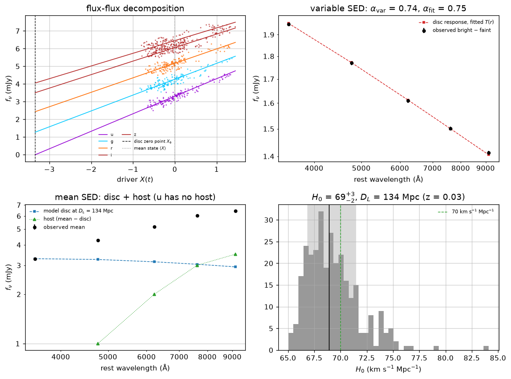

# Disc SED, luminosity distance and H₀

The delays measure the disc's size in light-days, and so its temperature profile $T(r)$. A disc
with that temperature profile, seen at the fitted inclination, has a definite spectrum; how bright
it *looks* then depends only on how far away it is. Comparing the model disc with the observed disc
flux gives the luminosity distance $D_L$, and with the redshift, the Hubble constant. This is the
test of Cackett, Horne & Winkler (2007, MNRAS 380, 669), who found $H_0 = 44 \pm 5$ km s⁻¹ Mpc⁻¹
from 14 AGN discs, a factor of 1.6 below the accepted value: the discs were fainter (or, equivalently,
larger) than the standard model predicts.

pycream2 runs it after any fit, opt-in, and adds it to the report. It answers three questions:

1. Is the **variable SED** (bright minus faint) consistent with the disc that the delays imply?
2. What **host galaxy** light lies under the disc in each band?
3. What **$D_L$ and $H_0$** does the disc give, and are they plausible?

An implausible $H_0$ is a useful warning on its own: it means the disc fit is absorbing something
other than reverberation (see [Caveats](#caveats)).

## Quick start

```python
from pycream2 import EchoFit

ef = EchoFit(
    M_BH=2.55e8,
    redshift=0.047,               # needed
    flux_unit="mJy",              # or "f_lambda" with flux_scale=1e-15 (erg/s/cm^2/A)
    ebv_galactic=0.022,           # Schlafly & Finkbeiner (2011) towards the AGN
    sed_analysis=True,            # run after every fit() / optimise()
)
for name, wavelength_rest, t, y, yerr in my_bands:   # rest-frame wavelengths, absolute fluxes
    ef.add_lightcurve(name, wavelength_rest, t, y, yerr, fit_error_model=True)
ef.build_grid()
ef.optimise()                     # or ef.fit()

ef.disc_sed["summary"]["h0"]      # [16th, 50th, 84th percentile]
fig, axes = ef.plot_disc_sed()
```

Or after the fact, on any fitted `EchoFit`, with any setting overridden for that call:

```python
summary = ef.disc_sed_analysis(redshift=0.047, ebv_galactic=0.022)
```

From the command line, `scripts/fit_lightcurves.py --sed-analysis --redshift 0.047 --ebv-galactic 0.022`
(see `--help` for the rest). Further options go in `sed_options` (or as keyword arguments to
`disc_sed_analysis`):

| option | default | meaning |
|---|---|---|
| `distance_method` | `"host_band"` | which estimator gives $D_L$ (below) |
| `host_band` | the bluest band | the band assumed to have no host light |
| `fit_intrinsic_ebv` | `False` | fit an intrinsic $E(B-V)$ with $D_L$ (needs `"flux_flux"`) |
| `omega_m` | 0.3 | flat ΛCDM, for converting $D_L$ to $H_0$ |
| `lamppost_height_rs` | 3 | the lamppost height for the predicted variable SED |
| `include_irradiation` | `True` | mix lamppost irradiation into $T(r)$, as `thin_disk_response` does by default; set `False` for a fit made with the viscous-only response |
| `irradiation_weight` | 0.5 | irradiation's share of $T^4$ at each band's Wien radius |
| `n_draws` | 300 | posterior draws used |

**Requirements:** absolute fluxes (not normalised or mean-subtracted light curves; the analysis
warns if they look it), **rest-frame** band wavelengths (as the disc physics needs anyway), and a
disc model (at least one `lag_mode="physical"` band).

## The method

### The model disc

The fitted `log_mdot` and the black hole mass give $T_1$, the temperature at 1 light-day
(`forward_model.disk_t1_kelvin`), and

```math
T(r) = T_1\, r^{-\alpha} \left(1 - \sqrt{r_{\rm in}/r}\right)^{1/4},
```

with $\alpha = 3/4$, or the fitted `temperature_slope`. By default (`include_irradiation=True`) the
analysis uses the same profile as the response function, with lamppost irradiation mixed in:
$T^4 = w\,T_{\rm irr}^4 + (1-w)\,T^4_{\rm visc}$, the viscous $T^4_{\rm visc}$ being the
expression above and $T_{\rm irr}^4 \propto (r^2+h^2)^{-3/2}$ scaled so that its share of $T^4$ is
$w$ at each wavelength's Wien radius (see [Thin-disk response function](thin_disk_response.md)).
This makes the disc a few per cent brighter than the viscous profile alone. Seen at inclination $i$ from luminosity
distance $D_L$, its flux density at observed frequency $\nu$ is

```math
f_\nu = \frac{(1+z)\cos i}{D_L^2} \int_{r_{\rm in}}^{\infty} B_\nu\!\big(\nu(1+z),\, T(r)\big)\, 2\pi r\, \mathrm{d}r .
```

### Flux-flux decomposition

Each band's model light curve is $F_\lambda(t) = C_\lambda + S_\lambda X(t)$, linear in the driver
$X(t)$. The constant $C_\lambda$ contains the host galaxy and anything else that does not vary. The
**host band** (by default the bluest) is assumed to have no host light; the disc's zero point $X_0$
is where its model flux vanishes, and $C_\lambda + S_\lambda X_0$ is each band's constant component
on that assumption. With a diffuse continuum (`diffuse_continuum=True`), only the disc's share
$1 - f_\lambda$ of the reverberating flux counts as disc.

### Dust

Every flux is converted to mJy and corrected for Galactic extinction (Cardelli, Clayton & Mathis
1989, $R_V = 3.1$, at the observed wavelength). With `fit_intrinsic_ebv=True`, an intrinsic
$E(B-V)$ in the AGN (same law, at the rest wavelength) is fitted together with the distance, as
Cackett et al. (2007) did.

### The variable SED

The bright-minus-faint spectrum, $S_\lambda (X_{98} - X_{2})$ (the driver's 98th and 2nd
percentiles over the data), is compared with the spectrum of the disc's response to the lamppost,

```math
\Delta f_\nu \propto \int \frac{\partial B_\nu}{\partial T}\, \frac{h}{x^3\,T^3}\; 2\pi r\, \mathrm{d}r,
\qquad x^2 = r^2 + h^2,
```

for the fitted $T(r)$. Only the shape is predicted (the lamppost's luminosity change is unknown), so
the prediction is scaled to the data. A power law $\Delta f_\nu \propto \nu^p$ fitted to the observed
points gives $\alpha_{\rm var} = 1/(p+1)$, the temperature slope the variable SED implies on its own
(for $\delta T^4 \propto h/x^3$); compare it with the slope from the delays.

### Two distance estimators

- **`distance_method="host_band"` (default).** The host band's whole mean flux is disc, so it alone
  gives $D_L$. Every other band's host is then its mean flux minus the model disc at that distance:
  a check, since it should be positive and rise to the red like a galaxy's. The analysis warns if it
  comes out negative (the model disc is brighter than the data: its spectrum is too red).
- **`distance_method="flux_flux"`.** The disc's flux in every band is the flux-flux one,
  $S_\lambda(\langle X\rangle - X_0)$, and $D_L$ (and the intrinsic $E(B-V)$) is fitted to all of them
  by least squares in log flux. This assumes the variable SED has the shape of the mean disc. The
  disc's response to the lamppost is bluer than the disc itself, so the flux-flux decomposition
  leaves some disc light in the redder bands' "host", and places the disc too far away.

Both are always computed and reported (`h0_host_band`, `h0_flux_flux`); `distance_method` picks
which is quoted as `dl_mpc`/`h0`. $H_0$ follows from $D_L$ in flat ΛCDM.

## Worked example

`scripts/plot_disc_sed_example.py` makes synthetic light curves with a known answer, using
`pycream2.synthetic.with_disc_fluxes`:
- a model disc at the distance $H_0 = 70$ gives at $z = 0.03$ (131.4 Mpc);
- variability following the disc's lamppost response;
- a host galaxy (none in u, rising to 3.5 mJy in z);
- Galactic $E(B-V) = 0.05$.

It fits them with `optimise()` and `sed_analysis=True`:

| | truth | host-band estimator | flux-flux estimator |
|---|---|---|---|
| $D_L$ (Mpc) | 131.4 | 133.5 (+4.1/−4.7) | |
| $H_0$ (km s⁻¹ Mpc⁻¹) | 70.0 | 68.9 (+2.5/−2.0) | 64.7 (+2.3/−1.9) |
| host flux, g / r / i / z (mJy) | 1.00 / 2.00 / 3.00 / 3.50 | 1.00 / 2.00 / 3.00 / 3.51 | 1.27 / 2.44 / 3.52 / 4.06 |

The host-band estimator recovers everything. The flux-flux estimator is biased by 8% in $H_0$, by
the effect described above; with `variable_sed="mean"` in `with_disc_fluxes` (variability exactly
proportional to the mean disc) it is unbiased too.



## Caveats

- **The host band must be host-free.** In the far UV (Swift W2, HST) the host is usually
  negligible; in the optical it is not, so use the bluest band you have. Any other non-varying light
  in that band (narrow lines, a diffuse continuum not modelled) makes the disc look nearer.
- **Slow variability.** A slow trend that is not reverberation (for example a months-long rise),
  left out of the model, is absorbed into long responses: the disc then looks larger and hotter, and
  so further away, by a large factor if the trend is strong ($H_0$ of order 10 km s⁻¹ Mpc⁻¹ is a
  typical symptom). Fit a slow background (`background_order`, see
  [Extra components](extra_components.md)) and check its evidence before trusting a distance.
- **The temperature scale is the model's.** $T_1$ depends on the response weighting (the lamppost
  geometry of `thin_disk_response`, see [Thin-disk response function](thin_disk_response.md)); a
  different reprocessing geometry changes the distance.
- **Steep profiles.** For $\alpha$ well above 3/4 the model disc's inner region is very hot, and its
  Rayleigh-Jeans emission dominates the UV-optical flux; the distance then depends on a region the
  delays do not probe.
- **Peculiar velocities** (typically 300 km s⁻¹) matter at low redshift: about 7% at $z = 0.015$.
