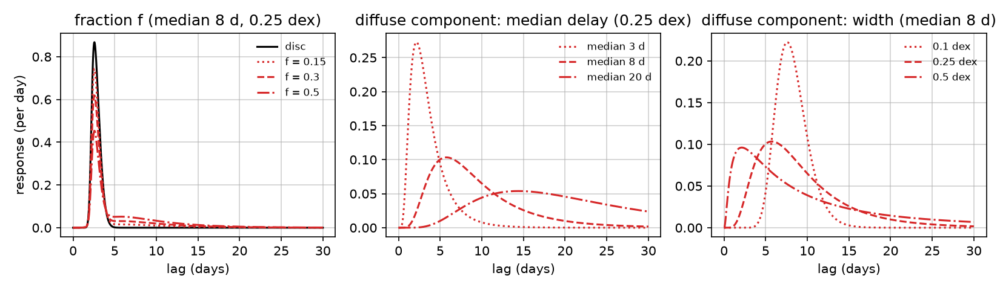
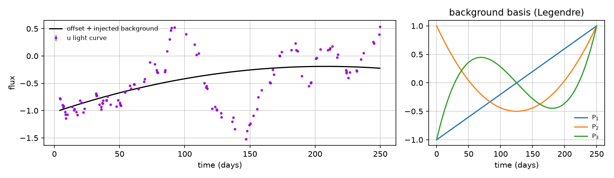
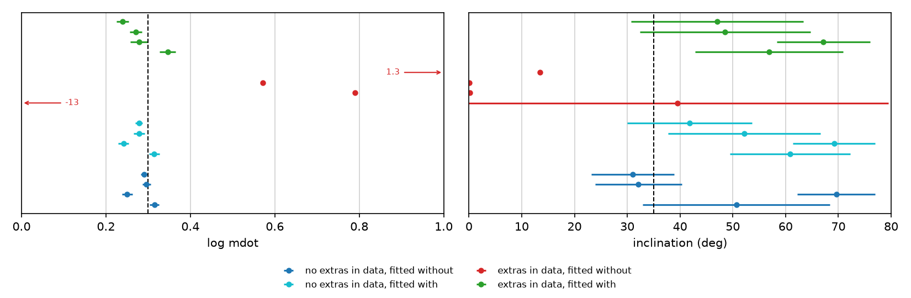
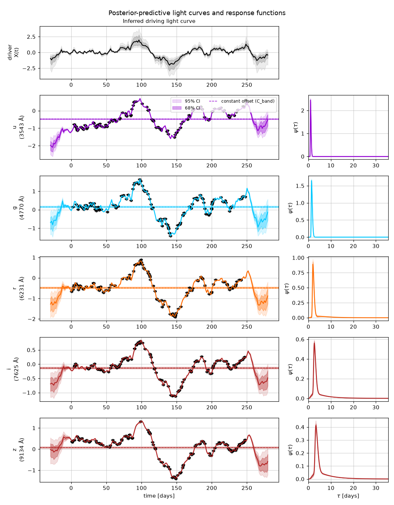

# Extra components: diffuse continuum and slow backgrounds

pycream2 models each light curve as a constant plus a scaled, delayed and
blurred echo of one driving light curve. Two optional components extend that
picture. Both are **off by default** and are switched on light curve by light
curve:

- **A second reprocessor** (`diffuse_continuum=True`): an extended
  reprocessing region with a log-normal delay distribution, mixed into a
  band's response. It is meant for diffuse continuum emission from the
  broad-line region (BLR).
- **A slowly varying background** (`background_order=K`): Legendre
  polynomials in time added to a light curve's constant offset. It is meant
  for slow variability that is not reverberation. Since October 2026 every
  light curve has a linear one (`background_order=1`) by default, for trends
  longer than the driver's longest period (`fitting_guide.md`, section 7);
  pass `background_order=0` to remove it.

This page explains why they are there (section 1), gives the mathematics
(section 2), shows how to use them (section 3), and tests on synthetic data
that the accretion-disc parameters are still recovered with them switched on
(section 4).

## 1. Why add them

### 1.1 Diffuse continuum from the broad-line region

Continuum reverberation mapping measures how the delay between light curves
grows with wavelength, and interprets it as light-travel time across an
accretion disc. Intensive campaigns have repeatedly found the delays too
long for a standard disc at the expected luminosity:
- Fausnaugh et al. (2016) found NGC 5548's disc to be about three times
  larger than thin-disc theory predicts.
- pycream2's own analysis of the same data finds the delays require
  $M\dot M$ tens of times too large.

The lag spectra also show structure a disc cannot make. The clearest case is
an excess delay around the Balmer jump at 3646 Å, resolved
spectroscopically in NGC 4593 by Cackett et al. (2018).

The broad-line region offers a natural explanation:
- **It emits a diffuse continuum.** The same gas that produces the broad
  emission lines also emits free-bound and free-free continuum, strongest in
  the Balmer and Paschen continua.
- **That continuum reverberates too.** It responds to the same ionising
  source, but from light-days to weeks out, where the BLR lies, rather than
  from the inner disc.
- **Photoionisation models predict a substantial effect.** Korista & Goad
  (2001, 2019) and Lawther et al. (2018) find this emission makes up a
  substantial fraction of the UV and optical continuum, and lengthens the
  measured inter-band delays, most strongly near the Balmer and Paschen
  jumps.

Mixed with the disc's response, it lengthens and broadens each band's
response function.

Cackett, Zoghbi & Ulrich (2022) modelled exactly this with two components per
band: a small disc, plus an extended BLR reprocessor with a **log-normal
delay distribution**, whose share of the response was free in each band.
The model reproduced the frequency-resolved lags of NGC 5548, with the BLR
fraction rising with wavelength. pycream2's `diffuse_continuum` option is
that model, embedded in the full forward fit rather than applied to lags
measured beforehand.

### 1.2 Slow variability that is not reverberation

The model assumes that, apart from a constant offset, all of a light curve's
variability is a delayed echo of the driver. Real light curves can also carry
slow trends that the driver does not explain. Possible sources include:
- slow changes in the host galaxy's or narrow-line region's contribution
  through the aperture;
- calibration drifts between seasons or telescopes;
- intrinsic disc variability on long time-scales that is not driven from
  the centre.

Such trends matter:
- **They bias lags.** Welsh (1999) showed that long-term trends bias
  cross-correlation lags low, and recommended removing them with low-order
  polynomials before measuring lags ("detrending").
- **They can dominate the light curves.** In a 1.8-year Swift campaign on
  Fairall 9, Edelson et al. (2024) found the UV and optical light curves
  dominated by long time-scale variations, and detrended them with
  second-order polynomials to recover the short reverberation delays.

In a forward-modelling fit, an unmodelled band-specific trend has nowhere to
go but into the driver and the disc parameters.

Detrending before fitting has two drawbacks. It throws away information, and
it carries none of the trend's uncertainty into the result. pycream2 instead
fits the trend jointly with everything else, as polynomial terms whose
coefficients have Gaussian priors. Because those coefficients enter the
model linearly, they are integrated out exactly (section 2.4), at almost no
cost.

## 2. The model

### 2.1 Light curves

With both components switched on, light curve $\lambda$ is modelled as

```math
F_\lambda(t) = C_\lambda + \sum_{k=1}^{K_\lambda} b_{\lambda,k}\,P_k\big(x(t)\big)
+ S_\lambda \int_0^\infty \psi_\lambda(\tau)\,X(t-\tau)\,\mathrm d\tau ,
```

where:
- $C_\lambda$ is the band's constant offset;
- $P_k$ are Legendre polynomials of the time mapped onto the campaign
  (section 2.3), with coefficients $b_{\lambda,k}$;
- $S_\lambda$ is the band's gain;
- $X$ is the driver;
- $\psi_\lambda$ is the band's response, area-normalised.

With $K_\lambda = 0$ and no diffuse continuum, this is the standard model.

### 2.2 The two-component response

With `diffuse_continuum=True` the response is a mixture,

```math
\psi_\lambda(\tau) = (1 - f_\lambda)\,\psi_{\mathrm{disc}}(\tau\,|\,\lambda)
+ f_\lambda\,\psi_{\mathrm{LN}}(\tau;\,\tilde\tau_\lambda, s_\lambda),
```

where $\psi_{\mathrm{disc}}$ is the band's usual response (physical or free
lag). The diffuse component is a log-normal in delay,

```math
\psi_{\mathrm{LN}}(\tau;\,\tilde\tau, s) = \frac{1}{\sqrt{2\pi}\,\sigma\,\tau}
\exp\!\left[-\frac{(\ln\tau - \ln\tilde\tau)^2}{2\sigma^2}\right],
\qquad \tau > 0, \qquad \sigma = s\ln 10 ,
```

and zero for $\tau \le 0$. This is Cackett et al. (2022)'s form, with their
$M = \ln\tilde\tau$ and $S = \sigma$. Its moments are:

| Quantity | Value |
|---|---|
| median | $\tilde\tau$ |
| mean | $\tilde\tau\mkern3mu e^{\sigma^2/2}$ |
| mode | $\tilde\tau\mkern3mu e^{-\sigma^2}$ |
| rms of $\log_{10}\tau$ | $s$ |

Three parameters per band describe it:

| Parameter | Site | Meaning | Prior |
|---|---|---|---|
| $f_\lambda$ | `dce_fraction_{band}` | the diffuse component's share of the band's integrated response | $\mathcal U(0, 1)$ |
| $\tilde\tau_\lambda$ | `dce_delay_{band}` | its median delay (days) | log-uniform on $[0.1, \tau_\mathrm{max}]$ |
| $s_\lambda$ | `dce_width_{band}` | its rms width (dex) | $\mathcal U(0.05, 1)$ |

The width is in dex because a reprocessing region's geometry sets its
*fractional* spread in delay. 0.05 dex is a 12 per cent spread, about the
narrowest a lag grid resolves; 1 dex is a factor-of-ten spread. The median
delay's log-uniform prior is scale-free, because BLR delays span decades.
The bounds are `model.DCE_DELAY_MIN` and `model.DCE_WIDTH_PRIOR_DEX`.

Both parts are area-normalised, so $S_\lambda$ still multiplies the whole
response:
- the integrated response of the disc part is $(1 - f_\lambda) S_\lambda$;
- that of the diffuse part is $f_\lambda S_\lambda$.

The mean delay is the weighted mean of the two parts,

```math
\langle\tau\rangle_\lambda = (1 - f_\lambda)\,\langle\tau\rangle_{\mathrm{disc}}
+ f_\lambda\,\tilde\tau_\lambda\,e^{\sigma_\lambda^2/2} .
```

So a modest diffuse fraction with a delay of days can lengthen a band's
apparent lag far more than it changes the disc.

Two consequences of the mixture's linearity:
- **The closed-form convolution is unchanged.** The driver's Fourier
  transfer coefficients are linear in $\psi$, so
  $A_k = (1 - f)A_k^{\mathrm{disc}} + fA_k^{\mathrm{LN}}$, and likewise $B_k$.
- **Everything downstream works as before.** The response function's
  contract (causal, area-normalised on the lag grid), the linear
  marginalisation and the plots all apply to the mixture.

The log-normal is evaluated on the lag grid and normalised numerically
there. It is differentiable in all three parameters.

### 2.3 The slow background

With `background_order=K`, a light curve gains $K$ Legendre polynomials in
the normalised time

```math
x(t) = \frac{2(t - t_0)}{t_1 - t_0} - 1 \in [-1, 1],
```

where $t_0$ and $t_1$ are the first and last observation times over **all**
light curves. Every light curve's background, and the plots, therefore use
the same time axis.

The polynomials follow Bonnet's recursion,
$(k+1)P_{k+1} = (2k+1)\mkern3mu x\mkern3mu P_k - k\mkern3mu P_{k-1}$, with $P_0 = 1$ and $P_1 = x$.
$P_0$ is left out, because the constant is already the offset $C_\lambda$.

Legendre polynomials rather than plain powers keep the columns close to
orthogonal over the campaign, since
$\int_{-1}^{1} P_j P_k\mkern3mu \mathrm dx = 2\delta_{jk}/(2k+1)$. The coefficients
are then nearly independent and well conditioned, which plain powers of $t$
are not. Because $|P_k| \le 1$ on $[-1, 1]$, each coefficient is roughly the
amplitude of its term.

Each coefficient has the prior

```math
b_{\lambda,k} \sim \mathcal N\big(0,\ (w\,\mathrm{std}(y_\lambda))^2\big),
\qquad w = 1 ,
```

so a trend up to about the light curve's own variability is expected
($w$ is `model.BACKGROUND_PRIOR_WIDTH`). The
coefficients are `bg_{band}` (or `bg_driver`), one vector of length $K$ per
light curve. `add_driver_lightcurve(..., background_order=K)` gives the
driver light curve a background too.

### 2.4 Exact marginalisation

With every nonlinear parameter fixed, the predicted light curves are linear
in:
- the driver's Fourier coefficients;
- the offsets $C_\lambda$;
- the background coefficients $b_{\lambda,k}$.

All of these have Gaussian priors, so they can be integrated out of the
likelihood exactly. Writing
$\boldsymbol y = M\boldsymbol\theta + \boldsymbol\epsilon$, with the linear parameters whitened by their prior
widths ($\boldsymbol\theta \sim \mathcal N(0, I)$) and
$\boldsymbol\epsilon \sim \mathcal N(0, D)$,

```math
p(\boldsymbol y\,|\,\boldsymbol z) = \mathcal N(\boldsymbol y;\ \boldsymbol m,\ D + MM^\top).
```

Each light curve's background contributes $K_\lambda$ columns,
$w\mkern3mu \mathrm{std}(y_\lambda)\mkern3mu P_k(x(t))$, to $M$, non-zero only on that light
curve's rows. They sit after the Fourier and offset columns
(`model._linear_marginal`).

`optimise()` and `marginalise_linear=True` therefore never sample the
background coefficients. Their exact conditional posterior is drawn
afterwards, so `ef.samples["bg_{band}"]` is filled as usual.
`tests/test_extra_components.py` checks this marginal likelihood against
dense float64 integration, with the design matrix taken independently from
`jax.jacobian` of the sampled model, to $10^{-4}$.

The diffuse continuum's parameters are nonlinear (they reshape $\psi$), so
they are sampled, or optimised, with the disc's.

### 2.5 Identifiability

**Diffuse continuum and disc.** The two parts are told apart by their
shapes and delays:
- the disc's response is compact, with its delay rising steeply with
  wavelength;
- the diffuse component is broad, with a delay set by the BLR.

The separation is clean when the diffuse delay is longer than the disc's and
the data resolve the response's shape. It weakens when the two have similar
delays: then $f_\lambda$ trades off against the disc's own parameters.

The log-uniform prior on the delay does not stop the diffuse component from
imitating the disc. If you know something, use it:
- pin a parameter with `fixed_params`, for example
  `{"dce_width_r": 0.3}`;
- give the diffuse continuum only to the bands where you expect it: redder
  bands, and bands containing the Balmer or Paschen jump.

**Background and driver.** The driver is shared by all bands. Each band sees
it scaled by its gain and smoothed by its own response. A background is
independent in each light curve. The background therefore captures trends
that **differ** between light curves. A trend common to every band (in
proportion to their gains) is variability of the driver, and its slow Fourier
terms take it.

Two cautions:
- **High orders can absorb real signal.** They can soak up genuine
  reverberation on long time-scales, especially in the bands with the
  longest delays. Use $K = 1$ or $2$, and rarely more than 3.
- **Correlated noise.** On real data, a background also absorbs part of any
  slow, correlated residual that the white-noise error model cannot.

**Deciding whether a component is warranted.** After `optimise()`,
`ef.log_evidence` holds the Laplace estimate of the log evidence,

```math
\ln Z \approx -U(\boldsymbol z^\star) + \tfrac d2\ln 2\pi + \tfrac12\ln\det\Sigma ,
```

where:
- $U$ is the negative log marginal posterior and $\boldsymbol z^\star$ its
  peak;
- $d$ is the number of nonlinear parameters;
- $\Sigma$ is the Laplace covariance.

Fit with and without a component, on the same data, and keep it only if
$\ln Z$ rises. Section 4 shows that this works: the evidence penalises
components that are not in the data and prefers them when they are.

## 3. Usage

```python
from pycream2 import EchoFit

ef = EchoFit(M_BH=1e8)
ef.add_lightcurve("u", 3543.0, t_u, y_u, yerr_u, background_order=2)
ef.add_lightcurve("g", 4770.0, t_g, y_g, yerr_g)                    # background_order=1, the default
ef.add_lightcurve("r", 6231.0, t_r, y_r, yerr_r, diffuse_continuum=True, background_order=0)
ef.add_lightcurve("i", 7625.0, t_i, y_i, yerr_i, diffuse_continuum=True)
ef.build_grid()
ef.optimise()          # or ef.fit() for NUTS

ef.samples["dce_fraction_r"], ef.samples["dce_delay_r"], ef.samples["dce_width_r"]
ef.samples["bg_u"]     # shape (n_samples, 2)
ef.log_evidence        # compare with the same fit without the components
fig, axes = ef.plot_lightcurve_fits()   # mixed responses; model curves include the backgrounds
```

From the command line, `scripts/fit_lightcurves.py` takes:
- `--diffuse-continuum [BAND ...]`, which applies to every band if none are
  named;
- `--background-order K`, which applies to every light curve, including the
  driver.

Synthetic data with known components come from
`pycream2.synthetic.generate_synthetic_dataset(...,
diffuse_continuum={band: (fraction, median, width_dex)},
background={band: [b_1, ..., b_K]})`. These use the same basis and time axis
as the fit, so the true coefficients compare directly with `bg_{band}`.

Both components are persisted across `EchoFit.resume()`. The diffuse
continuum's parameters can be pinned with `fixed_params`. Section 13 of the
demo notebook (`notebooks/demo.ipynb`) runs an example.

## 4. Tests on synthetic data

`scripts/plot_extra_components.py` regenerates every figure and number in
this section. It takes about 30 minutes; `--replot` redraws the recovery
figure from the saved results, `docs/images/extra_components_study.json`.

### 4.1 The two components



*Left: the i-band disc response, mixed with a diffuse component (median
8 days, 0.25 dex) of increasing fraction f. Middle and right: the diffuse
component alone, varying its median delay and its width.*



*Left: a synthetic u-band light curve with a slow parabolic background (black,
offset plus background) under its reverberation signal. Right: the first
three Legendre basis functions over the campaign.*

### 4.2 Recovery study

**Design.** Synthetic light curves come from
`synthetic.generate_synthetic_dataset`:
- **Bands and sampling:** five bands from u to z, 120 epochs each over 250
  days, 3 per cent noise, and pycream2's default (skew-normal) response.
- **Disc:** $M_\mathrm{BH} = 10^8\mkern3mu M_\odot$, $\log\dot m = 0.3$,
  $i = 35^\circ$.
- **Two kinds of data set:**
  - *plain*: no extra components;
  - *extras*: a diffuse continuum in r, i and z (fractions 0.2, 0.3 and 0.4,
    rising with wavelength as Cackett et al. 2022 found; median delay 8 days;
    width 0.25 dex), plus slow quadratic trends in u
    ($b = [0.4, -0.2]$) and z ($b = [-0.3, 0.15]$).
- **Fits:** each of four noise realisations of each data set is fitted with
  `optimise()` (2 restarts) twice: without the components, and with them
  switched on in exactly those bands.

A typical fit took about 30 seconds.



*The disc parameters (Laplace mean and standard deviation) for each fit; the
dashed line is the truth. Arrows mark fits off the plotted range, labelled
with their values.*

| Data | Fitted | $\log\dot m$ (true 0.3) | mean | scatter | typical error | $i$ (true 35°) |
|---|---|---|---|---|---|---|
| plain | without components | 0.315, 0.250, 0.296, 0.291 | 0.288 | 0.027 | 0.010 | 31 to 70° (± ~8°) |
| plain | **with** components | 0.314, 0.242, 0.279, 0.278 | 0.278 | 0.030 | 0.012 | 42 to 69° (± ~12°) |
| extras | without components | −13, 0.79, 0.57, 1.30 | | | | 0 to 39° |
| extras | **with** components | 0.346, 0.279, 0.271, 0.240 | 0.284 | 0.045 | 0.017 | 47 to 67° (± ~15°) |

**Switching the components on where the data have none does not bias the
disc.**
- $\log\dot m$ moves by at most 0.017 from the fit without them, and its
  error grows by only about 20 per cent.
- The evidence penalises the unneeded components in three of the four
  realisations ($\Delta\ln Z = -21$, $-26$ and $-14$).
- In the fourth it prefers them ($+33$), absorbing some of the mismatch
  between the simulation and the fit (their driver grids differ slightly).
  So a positive $\Delta\ln Z$ of tens should be treated with some caution
  on its own.

**Ignoring components that are present is catastrophic.** Without them, the
fits fail outright:
- $\log\dot m$ comes out between −13 and 1.3;
- the inclination is pushed to the face-on limit;
- $\ln Z$ falls by 22,000 to 35,000, so the evidence leaves no doubt.

Here the slow trends dominate: they cannot be absorbed by the driver, which
is shared by every band.

**With the components, the disc is recovered.** $\log\dot m$ is
$0.284 \pm 0.045$ (mean and scatter over realisations) against a true 0.3,
much as without any extra components ($0.288 \pm 0.027$). The inclination is
as loosely constrained as it is without them; this is the skew-normal
response, whose inclination information is weak at this cadence. The extra
components cost about 1.5 times in the disc parameters' uncertainty and
scatter.

**The components themselves are recovered:**

| | true | recovered (mean and range over 4 realisations) | typical error |
|---|---|---|---|
| r: fraction, median delay, width | 0.2, 8 d, 0.25 dex | 0.29 (0.23 to 0.33), 5.6 d (4.5 to 6.9), 0.34 dex | 0.03, 0.7 d |
| i: fraction, median delay, width | 0.3, 8 d, 0.25 dex | 0.36 (0.29 to 0.41), 7.2 d (5.9 to 9.0), 0.30 dex | 0.03, 0.5 d |
| z: fraction, median delay, width | 0.4, 8 d, 0.25 dex | 0.43 (0.33 to 0.47), 7.8 d (7.0 to 9.3), 0.26 dex | 0.03, 0.4 d |
| u background $b_1, b_2$ | 0.4, −0.2 | within 0.011 of the truth | 0.003 |
| z background $b_1, b_2$ | −0.3, 0.15 | within 0.011 of the truth | 0.002 |

- **The backgrounds** are recovered almost exactly.
- **The diffuse components** are recovered well where they are strong (i and
  z). Where they are weakest (r, 20 per cent of the response) they show the
  expected trade-off: a larger fraction with a shorter, broader delay gives
  a similar mean delay, so the fraction comes out high and the delay short.

**The quoted errors understate the scatter between realisations, by about 2
to 3 times.** This holds both for the disc parameters in every
configuration and for the diffuse parameters. It is a property of these
synthetic fits (the Laplace approximation, and the simulation's slightly
different driver grid), not of the extra components. Treat single-fit error
bars as lower limits, and check them with PSIS or NUTS where it matters.

### 4.3 An example fit



*One realisation of the "extras" data, fitted with both components.*
- **Response panels:** the mixed response. The disc's sharp peak is followed
  by the diffuse component's long tail in r, i and z.
- **Light-curve panels:** the model curves include the fitted backgrounds,
  so u and z follow their slow trends.

### 4.4 Unit and integration tests

`tests/test_extra_components.py` checks the following:
- **Log-normal response:** causal and area-normalised, with the right median
  and dex width, and differentiable in both parameters.
- **The mixture:** keeps the area and weights the mean delay correctly.
- **Legendre basis:** matches NumPy's.
- **Off by default:** no extra sites appear.
- **Switched on:** the right sites appear, in both the sampled and the
  marginalised model.
- **Exact marginalisation:** the marginal likelihood with both components
  agrees with dense brute-force integration to $10^{-4}$.
- **`fixed_params`:** accepts the diffuse-continuum sites only when they
  exist.
- **Validation:** a negative `background_order` is rejected.
- **Resume:** both components persist across `EchoFit.resume()`.
- **Recovery:** an end-to-end recovery test (as in section 4.2) checks that
  the restarts agree, the disc and components are recovered, and the
  evidence prefers the true components by more than 10.

## 5. References

- Cackett, E. M., Chiang, C.-Y., McHardy, I., et al. 2018, ApJ, 857, 53:
  [Accretion disk reverberation with HST observations of NGC 4593: evidence for diffuse continuum lags](https://iopscience.iop.org/article/10.3847/1538-4357/aab4f7)
- Cackett, E. M., Zoghbi, A., & Ulrich, O. 2022, ApJ, 925, 29:
  [Frequency-resolved lags in UV/optical continuum reverberation mapping](https://iopscience.iop.org/article/10.3847/1538-4357/ac3913)
- Edelson, R., Peterson, B. M., Gelbord, J., et al. 2024, ApJ, 973:
  [Intensive broadband reverberation mapping of Fairall 9 with 1.8 yr of daily Swift monitoring](https://iopscience.iop.org/article/10.3847/1538-4357/ad64d4)
- Fausnaugh, M. M., Denney, K. D., Barth, A. J., et al. 2016, ApJ, 821, 56
- Korista, K. T., & Goad, M. R. 2001, ApJ, 553, 695
- Korista, K. T., & Goad, M. R. 2019, MNRAS, 489, 5284:
  [Quantifying the impact of variable BLR diffuse continuum contributions on measured continuum inter-band delays](https://dx.doi.org/10.1093/mnras/stz2330)
- Lawther, D., Goad, M. R., Korista, K. T., Ulrich, O., & Vestergaard, M. 2018, MNRAS, 481, 533:
  [Quantifying the diffuse continuum contribution of BLR clouds to AGN continuum inter-band delays](https://academic.oup.com/mnras/article/481/1/533/5076066)
- Welsh, W. F. 1999, PASP, 111, 1347:
  [On the reliability of cross-correlation function lag determinations in active galactic nuclei](https://iopscience.iop.org/article/10.1086/316457)
