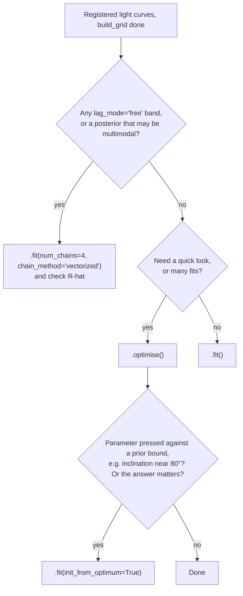

# Fitting guide: every setting, its default, and when to change it

This is the one place to look when choosing how to run a fit. Each setting
gets its default, when to change it, and the reason, with the mathematics
and measured evidence summarised here and derived in full in the
companion documents:

- [`performance_improvements.md`](performance_improvements.md): the
  benchmarks behind the current defaults, with the maths of the solvers.
- [`mcmc_implementation.md`](mcmc_implementation.md): how NUTS works, and
  what the mass matrix does.
- [`thin_disk_response.md`](thin_disk_response.md): the physical
  thin-disk response function.

The numbers quoted come from one synthetic benchmark (5 bands × 100
observations, `n_freq = 60`, `n_tau = 400`) unless stated otherwise. Ratios
carry over better than absolute timings; real campaigns with many more
bands or points can shift them.

---

## 1. The short version

```python
from pycream2 import EchoFit

ef = EchoFit(M_BH=5e7)                        # M_BH is fixed, never fitted
for name, wav, t, y, yerr in my_bands:
    ef.add_lightcurve(name, wavelength=wav, t=t, y=y, yerr=yerr)
ef.build_grid()                               # watch for resolution warnings

ef.optimise()                                 # fast first look, no MCMC
ef.plot_lightcurve_fits()

ef.fit()                                      # the full posterior (NUTS, dense mass)
print(ef.extra_fields["diverging"].sum(), "divergences")
```

Every default is the fastest *correct* choice for full MCMC that has been
measured. The one deliberate exception: `.fit()` runs MCMC rather than the
faster `.optimise()`, because MCMC is exact and `.optimise()` is an
approximation (section 3). Use `.optimise()` for speed, and `.fit()` when
the answer matters.

### Which solver?



---

## 2. Every setting at a glance

| Setting | Where | Default | Change it when | Section |
|---|---|---|---|---|
| `M_BH` | `EchoFit(...)` | required for physical bands | never fitted: set from the literature | 8 |
| `drw_prior` | `EchoFit(...)` | `False` (random walk) | you want a damping timescale `tau_drw` and have a long enough baseline to constrain it | 6 |
| `fixed_params` | `EchoFit(...)` | `{}` | a parameter is known, or badly constrained and you'd rather pin it | 8 |
| `marginalise_linear` | `EchoFit(...)` | `False` | rarely: exact, but ~2× slower for NUTS here | 3 |
| `title`, `output_dir` | `EchoFit(...)` | `None` | long runs you may need to resume (checkpointed, single chain) | 4 |
| `lag_mode` | `add_lightcurve` | `"physical"` | emission lines, or any band whose lag shouldn't follow the disk law | 7 |
| `fit_error_model` | `add_lightcurve`, `add_driver_lightcurve` | `False` | real data whose quoted errors you don't fully trust | 7 |
| `diffuse_continuum` | `add_lightcurve` | `False` | delays look too long for a disc, or there is a lag excess near the Balmer jump (broad-line-region diffuse continuum) | 7 |
| `background_order` | `add_lightcurve`, `add_driver_lightcurve` | `0` | slow trends unrelated to reverberation (try 1 or 2, keep it if `log_evidence` rises) | 7 |
| `n_freq` | `build_grid` | 60 | fewer for speed on short campaigns; more for long, finely sampled ones | 5 |
| `n_tau` | `build_grid` | 400 | a resolution warning appears | 5 |
| `tau_max` | `build_grid` | half the baseline | lags are known to be much shorter (sharper grid) | 5 |
| `tau_grid_power` | `build_grid` | 3.0 | a resolution warning for short-wavelength bands | 5 |
| `dt_min` | `build_grid` | 5th-percentile gap | very irregular cadence makes the estimate noisy | 5 |
| solver | method call | `.fit()` (NUTS) | `.optimise()` for speed (section 3) | 3 |
| `num_warmup`, `num_samples` | `fit` | 1000, 1000 | divergences (more warmup); smoother histograms (more samples) | 4 |
| `dense_mass` | `fit` | `True` | only a tiny warmup (it can't adapt) | 4 |
| `num_chains`, `chain_method` | `fit` | 1, `"parallel"` | free-lag bands or any doubt about convergence: 4 chains | 4 |
| `max_tree_depth` | `fit` | `None` (NumPyro's 10) | to cap worst-case cost per sample | 4 |
| `init_from_optimum` | `fit` | `False` | after `.optimise()`, to start NUTS at its peak | 3 |
| `checkpoint_every`, `report_every` | `fit` (with `title`) | 100, `None` | long runs; watching a report fill in | 4 |
| response function | `pycream2.model.response_function` | skew-normal | the physical thin-disk shape matters (section 9) | 9 |

---

## 3. Choosing the solver

### The three options

1. **`.fit()`: NUTS on every parameter** (the default). Samples the exact
   posterior. It is the reference every other option is checked against.
2. **`.optimise()`: direct solve, no MCMC.** Integrates the ~125 linear
   parameters (driver Fourier coefficients, band offsets) out *exactly*,
   finds the peak of what remains (about 8 nonlinear parameters) with
   L-BFGS, and approximates the posterior there as a Gaussian from the
   exact Hessian (the Laplace approximation). The linear parameters are
   then drawn exactly for every sample, so every plot works.
3. **`EchoFit(marginalise_linear=True)` + `.fit()`: NUTS on the marginalised
   model.** Exact, samples ~8 parameters, but each step costs ~21× more (a
   QR factorisation), so on the benchmark it is about 2× *less* efficient
   than option 1. Keep it for experiments.

### Why the linear parameters can be integrated out

With the nonlinear parameters $z$ fixed, every prediction is linear in the
linear parameters $\theta$, which have Gaussian priors:

```math
y = M(z)\,\theta + \varepsilon, \qquad \theta \sim \mathcal N(0, I), \qquad \varepsilon \sim \mathcal N(0, D),
```

so exactly, with no approximation,

```math
p(y \mid z) = \mathcal N\big(y;\; 0,\; D + M M^\top\big), \qquad p(\theta \mid y, z) = \mathcal N\big(\hat\theta,\; P^{-1}\big),\quad P = I + M^\top D^{-1} M.
```

The only approximation in `.optimise()` is the next step,

```math
p(z \mid y) \approx \mathcal N\big(z^\star,\; H^{-1}\big), \qquad z^\star = \arg\max_z p(z \mid y), \qquad H = -\nabla^2 \log p(z \mid y)\big|_{z^\star},
```

in NumPyro's unconstrained coordinates (logs of positive parameters,
logits of bounded ones). Full derivation:
[`performance_improvements.md` §3–4](performance_improvements.md#3-exact-linear-parameter-marginalisation).

### What that buys, and costs


| | `.fit()` (dense NUTS, 500 + 500) | `.optimise()` |
|---|---|---|
| Wall time, including compilation | 56 s | 27 s |
| `log_mdot` | 0.193 ± 0.011 | 0.194 ± 0.012 |
| inclination (°) | 59.0 ± 13.5 | 55.3 ± 14.0 |
| Exact? | yes, given enough samples | Gaussian approximation in $z$ |

`.optimise()`'s cost is mostly fixed (compilation, the Hessian, the draws),
so its advantage grows with longer NUTS runs.


**When `.optimise()` is not enough.** The Laplace approximation is exact
for a Gaussian posterior and good near one. It fails when:

- **a parameter presses against a prior bound.** In the figure, the true
  inclination posterior piles up against its 80° bound; the Gaussian
  (in logit space) rolls off instead;
- **the posterior is multimodal**, as free-lag bands can be (section 7);
- **the peak isn't converged.** `.optimise()` follows L-BFGS with Newton
  steps (exact Hessian, line-searched, accepted only if the posterior
  improves) until one more step would move the peak by under 0.01 posterior
  standard deviations. It reports the final figure as
  `ef.optimise_timings["newton_offset_in_sd"]` and warns above 0.25.

**Checking reproducibility: multi-start.** Every restart (`num_restarts`,
default 4) is polished to its own optimum and compared with the best, the
direct-solve counterpart of running several MCMC chains from different
starting points. `ef.optimise_restarts` lists each restart's distance from
the best (in posterior standard deviations) and how far above it sits in
potential; `optimise_timings["restarts_agreeing"]` counts those within 0.5
standard deviations, and the report shows a table and plot
(`ef.plot_optimise_restarts()`). It warns when any restart disagrees. Use
`restart_scale=1.0` (default 0.5) for starts spread more widely. On all 13
NGC 5548 bands with the thin-disk response, 8 restarts started up to 56
standard deviations apart all finished within 0.06 of the best; with the
skew-normal response only 3 of 8 agreed, exposing a flat inclination
direction that a single Laplace solve reports far too narrowly.

In those cases, run `.fit()`. `.fit(init_from_optimum=True)` starts NUTS at
`.optimise()`'s peak (single chain only, since identical starts would
defeat multi-chain convergence checks). It should shorten the warmup
needed, but that hasn't been benchmarked yet, so keep `num_warmup` at its
default.

---

## 4. NUTS settings (`.fit()`)

### `dense_mass` (default `True`)

NUTS moves through parameter space along simulated trajectories whose
shape is set by a mass matrix $M$, adapted during warmup to the
posterior's covariance. A **diagonal** $M$ rescales each parameter
independently; a **dense** $M$ also follows correlations. This model has
strong ones: scaling the driver by $\lambda$ and every band gain by
$1/\lambda$ leaves the likelihood unchanged, so `sigma_drw` and the gains
lie on a tilted ridge. A diagonal $M$ has to take tiny steps across that
ridge, and every sample hits the 1023-step ceiling:


| | Diagonal | Dense (default) |
|---|---|---|
| Median steps per sample | 1023 (ceiling) | 63 |
| Min ESS per total second | 0.44 | 7.4 (17×) |

The one case for `dense_mass=False` is a very short warmup (a few dozen
iterations), which is too little to estimate a dense matrix. The README
animation uses diagonal for exactly that reason. Mechanism and further
charts: [`mcmc_implementation.md` §2](mcmc_implementation.md#2-the-mass-matrix-and-what-dense_masstrue-changes).

### `num_warmup` and `num_samples` (default 1000 each)

Warmup adapts the step size and mass matrix; its draws are discarded.
The benchmarks used 500 + 500 without any divergences, so the default is
probably generous, but it hasn't been tuned across datasets. Raise
`num_warmup` if divergences exceed a few percent.

Samples are autocorrelated. What matters is the **effective sample size**,

```math
\text{ESS} = \frac{N}{1 + 2\sum_{k\ge1}\rho_k},
```

where $\rho_k$ is the chain's autocorrelation at lag $k$. With dense mass
the benchmark gave ESS of 413 to 700 from 500 draws. A few hundred
effective samples is plenty for means and standard deviations; tail
quantiles (95% intervals) want more. Raise `num_samples` if the
histograms look ragged. For an in-memory fit, `ef.mcmc.print_summary()`
prints ESS and $\hat R$ for every parameter.

### `num_chains` and `chain_method` (default 1, `"parallel"`)

One chain can't diagnose convergence against itself. Several chains from
independent starts let the Gelman–Rubin statistic compare them:

```math
\hat R = \sqrt{\frac{\widehat{\operatorname{var}}^+}{W}}, \qquad \widehat{\operatorname{var}}^+ = \frac{N-1}{N}W + \frac1N B,
```

with $W$ the mean within-chain variance and $B$ the between-chain
variance. $\hat R \approx 1$ (below ~1.01) means the chains agree.
**Always use 4 chains for free-lag bands** (section 7), and whenever the
answer matters. `chain_method="vectorized"` runs them in one process on
CPU, cheaply. The data-anchored initial guesses switch off automatically
for multiple chains, and `init_from_optimum=True` refuses them, because
identical starts would make $\hat R$ meaningless.

### `max_tree_depth` (default NumPyro's 10, so up to 1023 steps)

Caps the steps per sample. With dense mass, samples rarely go past 127, so
the cap rarely binds. Lower it only to bound worst-case cost while
experimenting: a trajectory cut off by the cap still yields a valid
sample, just a more autocorrelated one.

### `target_accept_prob` (0.85, not exposed on `.fit()`)

NUTS adapts its step size so that proposals are accepted about 85% of the
time. Raising the target shrinks steps and cures divergences in curved
regions, at the cost of longer trajectories. It is set in
`inference.run_mcmc` but **not currently passed through `EchoFit.fit()`**.
Use a longer `num_warmup` first; call `inference.run_mcmc` directly if you
need it.

### Checkpointing: `title`, `checkpoint_every`, `report_every`

`EchoFit(M_BH=..., title="my_run")` makes `.fit()` save its progress every
`checkpoint_every` samples (default 100), so a killed run continues with
`EchoFit.resume("my_run").fit()`. It covers the sampling phase only, not
warmup, and forces a single chain. `report_every` rewrites `report.html`
during the run. Use it for anything long enough that losing it would hurt.

---

## 5. Grid settings (`build_grid`)

### Frequency grid: `n_freq` (60) and `dt_min`

The driver is a sum of $n_f$ sinusoids on a log-spaced grid from the
longest period the baseline $T$ can show to the shortest the cadence can
resolve:

```math
\omega_\text{min} = \frac{2\pi}{T}, \qquad \omega_\text{max} = \frac{\pi}{\Delta t_\text{min}},
```

a Nyquist-style limit, with $\Delta t_\text{min}$ taken as the 5th
percentile of the observation gaps (robust to a few close pairs). Each
frequency adds two parameters. More frequencies give a more flexible
driver, but also more parameters for `.fit()` and a larger linear solve for
`.optimise()`. 60 suits campaigns of a few hundred days. Use fewer (15 to
30) for short or sparse campaigns, and pass `dt_min` explicitly if the
cadence is very irregular.

### Lag grid: `n_tau` (400), `tau_max`, `tau_grid_power` (3.0)

The response function is evaluated on

```math
\tau_j = \tau_\text{max}\left(\frac{j}{n_\tau - 1}\right)^{p}, \qquad j = 0, \dots, n_\tau-1,
```

with $p$ = `tau_grid_power`. Grading ($p > 1$) packs points near
$\tau = 0$, where short-wavelength responses are narrow (the disk lag grows
as $\lambda^{4/3}$). An under-resolved response silently normalises to a
flat, near-zero echo, so `build_grid()` warns when a band's expected
response is less than ~2 grid points wide. Fix a warning by raising `n_tau`
or `tau_grid_power`, or by lowering `tau_max` (default: half the baseline,
generous for disk lags).

A larger `n_tau` is now almost free: the Fourier transform of the response
uses precomputed matrices, so its cost barely changes with grid size.


---

## 6. Driver prior: `drw_prior` (default `False`)

The driver's Fourier coefficients get Gaussian priors whose variance
follows a power spectrum $P(\omega)$, discretised on the grid as
$\sigma_k^2 = P(\omega_k)\mkern3mu \Delta\omega_k$:

| `drw_prior` | $P(\omega)$ | Hyperparameters |
|---|---|---|
| `False` (random walk, default) | $\sigma_\text{drw}^2 / \omega^2$ | `sigma_drw` |
| `True` (damped random walk) | $\sigma_\text{drw}^2\mkern3mu  \tau_\text{drw} / \big(1 + (\omega \tau_\text{drw})^2\big)$ | `sigma_drw`, `tau_drw` |

The DRW flattens below $\omega \approx 1/\tau_\text{drw}$. That turnover is
only measurable if the baseline is several times $\tau_\text{drw}$
(typically hundreds of days). On shorter campaigns `tau_drw` is poorly
identified, and the random walk is one fewer parameter describing the same
behaviour on the observed timescales. Use `drw_prior=True` for long
baselines, or when `tau_drw` is itself of interest. `ef.plot_power_spectrum()`
compares the fitted $P(\omega)$ with the coefficients.

---

## 7. Per-light-curve settings

### `lag_mode`: `"physical"` (default) or `"free"`

- **`"physical"`**: the band's mean lag follows the thin-disk law
  $\tau \propto M_\text{BH}^{2/3}\mkern3mu \dot M^{1/3}\mkern3mu \lambda^{4/3}$ through the
  shared `log_mdot`, and its shape through the shared inclination. Use it
  for continuum bands reprocessed by the disk.
- **`"free"`**: the band gets its own lag `tau_{band}`. Use it for
  emission lines, or anything not on the disk law.

Free lags carry an exact degeneracy: shifting the driver by $\Delta$ and
every free lag by $-\Delta$ leaves every prediction unchanged. **A free-lag
fit needs a driver light curve** (`add_driver_lightcurve`), which pins the
origin; `.fit()` warns if one is missing. Even then, a broad lag prior can
leave the posterior **multimodal**: 1 of 3 single-chain test runs converged
confidently to lags 3 to 4 times too long. For free-lag fits, use
`num_chains=4` and check $\hat R$, and don't rely on `.optimise()`.

### `fit_error_model` (default `False`)

When on, the band's quoted errors are rescaled and inflated by two fitted
nuisance parameters:

```math
\sigma_\text{eff} = \sqrt{(s\,\sigma_\text{quoted})^2 + j^2}, \qquad s \sim \text{LogNormal}(0, 0.5), \quad j \sim \text{HalfNormal}(\overline{\sigma_\text{quoted}}).
```

Underestimated errors make every other posterior look tighter than it
really is. Turn this on for real data whose error bars you don't fully
trust. Leave it off for synthetic data, where the errors are exact by
construction. Pin either term with `fixed_params` (for example
`{"sigma_jitter_g": 0.0}`).

It matters in practice, not just in principle. On all 13 NGC 5548 AGN
STORM bands (2,632 points), with quoted errors of only 0.2 to 0.7% of the
flux, the thin-disk model cannot reach the quoted-error noise floor:

| 13 bands, dense NUTS, 500 + 300 | quoted errors | `fit_error_model=True` |
|---|---|---|
| divergences | 86 / 300 | 2 / 300 |
| median leapfrog steps per sample | 1023 (the ceiling) | 511 |
| minimum ESS | 4 | 32 |
| `.optimise()` | non-positive-definite Hessian, failed | converged (offset 0.00 sd) |

The fitted terms inflate the far-UV errors about 3 times and add jitter of
1 to 3 times the quoted error to every band. Point-to-point scatter within a
night is *consistent* with the quoted errors, so the errors are not wrong
as photometry; the extra variance is model mismatch (and inter-telescope
calibration) on longer timescales. Without the error model, `.optimise()`
already fails from 7 bands onwards. `scripts/fit_lightcurves.py
--fit-error-model` turns it on for every band.

### `diffuse_continuum` (default `False`) and `background_order` (default `0`)

Two optional components, described fully, with the mathematics, priors,
literature and a synthetic recovery study, in
[`extra_components.md`](extra_components.md).

- **`diffuse_continuum=True`** adds a second reprocessor with a log-normal
  delay distribution to the band's response, as for broad-line-region
  diffuse continuum emission (Cackett, Zoghbi & Ulrich 2022). It has three
  parameters per band: `dce_fraction_{band}`, `dce_delay_{band}` (median, in
  days) and `dce_width_{band}` (in dex).
- **`background_order=K`** adds `K` Legendre polynomials in time to the
  light curve's constant offset, for slow variability unrelated to
  reverberation (cf. detrending, Welsh 1999). The coefficients are linear,
  so `.optimise()` integrates them out exactly.

Both cost extra parameters and can trade off against the disc. Switch them
on where there is a physical reason, and keep them only if the evidence
(`ef.log_evidence` after `.optimise()`) prefers them.

### `add_driver_lightcurve`

A direct, zero-lag observation of the driver (for example X-ray or far-UV
continuum). It is required for free-lag bands (above), and helpful
otherwise: it constrains the driver directly and anchors the driver's
amplitude prior.

---

## 8. Model constants and pins: `M_BH`, `fixed_params`

`M_BH` is always a fixed input, never fitted. It sets the lag scale
together with `log_mdot` ($\tau \propto M_\text{BH}^{2/3}\dot M^{1/3}$), so
the two are degenerate from lags alone. Take it from the literature, and
remember that `log_mdot`'s posterior is conditional on it.

`fixed_params={"name": value}` pins any scalar parameter to a constant (for
example `{"inclination": 30.0}` for a face-on assumption, or a known
emission-line lag `{"tau_hbeta": 12.0}`). An unknown name raises at fit
time, so typos can't pass silently. Pinning a poorly constrained parameter
buys speed and stability at the price of an assumption. Say so when
reporting results.

---

## 9. Response function

The physical response is swappable by assignment. It is picked up by
fitting and plotting alike.

| Response | How | Cost per call (jitted) | Use when |
|---|---|---|---|
| Skew-normal (default) | nothing to do | cheapest (~12× below the fast thin disk) | lags and a plausible shape are enough |
| Thin disk, exact | `model.response_function = get_response("thin_disk")` | ~1.5 ms | the physical, inclination-dependent shape matters |
| Thin disk, templated | `model.response_function = build_thin_disk_response_fast(M_BH)` | ~0.55 ms | long thin-disk runs; small errors far from the template's reference point |

```python
import pycream2.model as model
from pycream2.responses import get_response
model.response_function = get_response("thin_disk")
```

The thin disk follows Starkey, Horne and Villforth (2016): a real
temperature profile and light-travel-time delay surface, rather than an
assumed shape. It costs more per step. Its default smoothing is causal (a 5
per cent Gaussian in ln τ), so the response is zero at zero lag, and its delay
includes the lamppost height, which adds h_x cos i (about 0.01 days for
NGC 5548) to the mean delay. Details and figures:
[`thin_disk_response.md`](thin_disk_response.md), and the comparison with
CREAM's own response in [`cream_response_comparison.md`](cream_response_comparison.md).

---

## 10. Checking a fit

After `.fit()`:

- **Divergences** (`ef.extra_fields["diverging"].sum()`): ideally zero; a
  few percent calls for more `num_warmup`; more than that means the
  posterior has regions NUTS can't explore. Don't trust the fit yet.
- **ESS**: at least a few hundred for the parameters you report.
- **$\hat R$** (multi-chain): below ~1.01.
- **Badness of fit** (`ef.plot_bof()`): flat during sampling. A downward
  trend means the chain was still burning in.
- **Light curves** (`ef.plot_lightcurve_fits()`): residuals without
  structure, and no flat-line predictions (a sign of an under-resolved lag
  grid, section 5).

After `.optimise()`:

- `ef.optimise_timings["newton_offset_in_sd"]` below ~0.25 (it warns
  otherwise).
- No parameter piled against a prior bound in `ef.plot_corner()`. If there
  is one, confirm with `.fit()`.

---

## Open questions

- **The default warmup length hasn't been tuned.** 500 was ample on the
  benchmark; whether the 1000 default can drop safely across real
  campaigns is unmeasured.
- **`init_from_optimum`'s effect on warmup** hasn't been benchmarked.
- **Benchmarks come from one synthetic dataset.** The dense-over-diagonal
  gain is the most robust result; the solver ratios could shift on much
  larger datasets.
