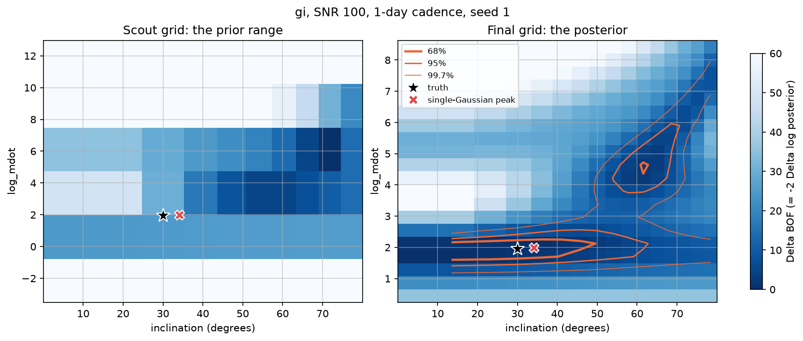
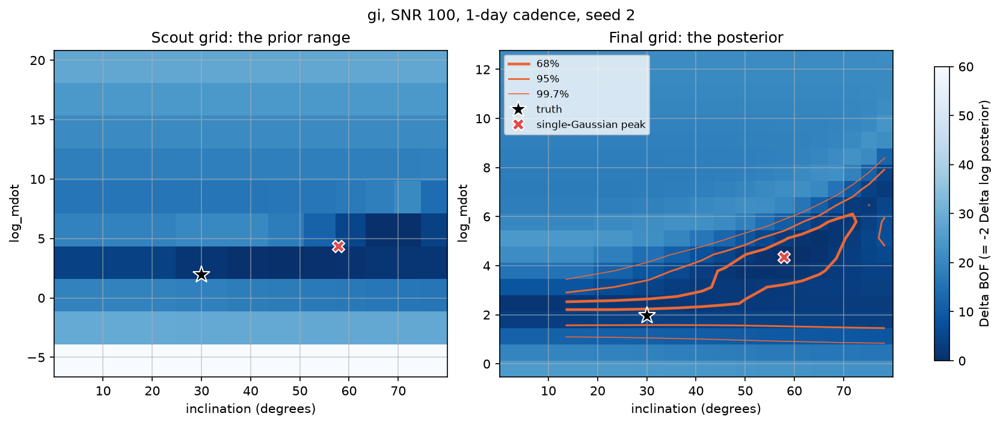
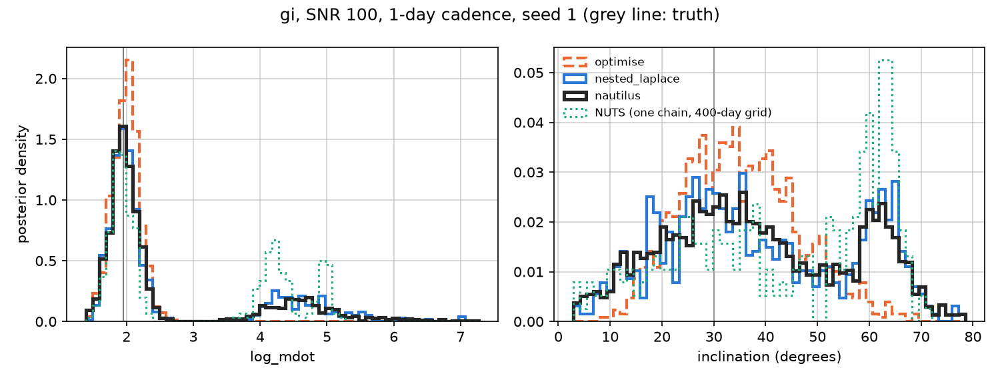
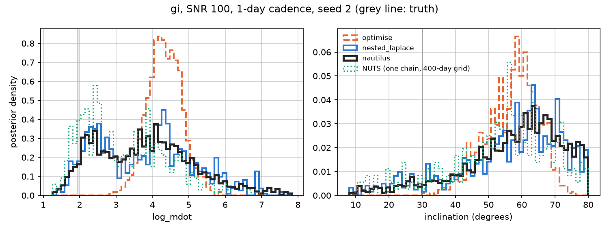

# Nested Laplace: the default direct solve

`ef.optimise()` gives the posterior of a fit without running MCMC. Since
October 2026 it does so with a **nested Laplace approximation**: it maps the
posterior of the accretion rate (`log_mdot`) and the inclination on a grid,
handles every other parameter analytically or nearly so at each grid point,
and checks the result against the exact posterior. It is about as fast as the
single-Gaussian solve it replaces, and much more honest when the data cannot
pin the disc down.

```python
ef.build_grid()
ef.optimise()                                  # nested Laplace (also: ef.nested_laplace())
print(ef.nested_laplace_result["k_hat"])       # below 0.7: the result is reliable
ef.plot_landscape()                            # the Badness-of-Fit map of log_mdot and inclination
ef.plot_corner()                               # every other plot and the report work as after .fit()

ef.optimise(method="laplace")                  # the older single-Gaussian solve
```

## Why: one Gaussian is not enough

A direct solve needs some description of the posterior's shape. The original
`optimise()` (now `optimise(method="laplace")`) found the single most probable
point and fitted a Gaussian to the curvature there. That is exact when the
posterior is Gaussian and good when it is close to it, which it is when the
data constrain the disc well.

When they don't, the posterior of `log_mdot` and the inclination stops looking
like a Gaussian. Synthetic tests in the style of the CREAM paper (Starkey,
Horne & Villforth 2016; random-walk driver, true M Mdot = 10^8 Msun^2/yr,
inclination 30 degrees, g and i at SNR 100, 1-day cadence) found both kinds of
failure. Here is the first, mapped as Badness of Fit (darker is a better fit):



There are two separate basins: one around the truth (the star) at low
inclination, and one at a higher accretion rate and about 60 degrees. The
single-Gaussian solve (the cross) sits at the bottom of the first and reports
an error bar six times too small, with no hint that the second exists. On a
second synthetic light curve the posterior is instead one long curved valley,
and the single-Gaussian solve reported one end of it as the answer:



These data genuinely cannot decide between a less inclined disc with a lower
accretion rate and a more inclined one with a higher rate. The right answer
is a broad posterior; the point is to report that rather than a false
precision. MCMC (NUTS) does not settle it cheaply either: a chain that
crosses between two basins once in hundreds of draws cannot weigh them.

## The idea

Most of the model's ~130 parameters are easy. The driver's Fourier
coefficients and each band's offset enter every predicted light curve
linearly, so they integrate out exactly. Of the ~10 that remain, only
`log_mdot` and the inclination make the posterior awkward; the others (the
driver's amplitude `sigma_drw` and each band's gain) are close to Gaussian once
those two are fixed.

So the nested Laplace approximation does the obvious thing:

1. **Lay `log_mdot` and the inclination out on a grid.** A grid follows
   whatever shape the posterior has, curved valleys and separate basins
   included.
2. **At every grid point, deal with the rest.** Optimise the few remaining
   parameters and integrate them with a Gaussian (Laplace) approximation,
   which is accurate for them; the linear parameters are already exact. That
   gives the posterior probability of that grid point.
3. **Check, and correct, against the exact posterior.** Draw samples from the
   grid, weight each by how probable it really is compared with how probable
   the approximation thought it was (importance sampling), and resample. The
   weights fix what the approximations miss, and their spread gives a
   reliability score, Pareto `k_hat`: below 0.7 the result can be trusted.

This is the integrated nested Laplace approximation (INLA; Rue, Martino &
Chopin 2009) with an importance-sampling correction (Berild et al. 2022),
adapted to pycream2's structure.

## Using it

- `ef.optimise()` and `ef.nested_laplace()` are the same method. Both fill
  `ef.samples` (including exact draws of the linear parameters), so every
  plot, the report and `ef.fit(init_from_optimum=True)` work unchanged.
- `ef.nested_laplace_result` holds `k_hat`, the effective sample size of the
  weights (`ess`), the grids and their log posterior, the modes found, and two
  evidence estimates; `ef.log_evidence` is the importance-sampling one, for
  comparing models fitted to the same data.
- It **warns** if `k_hat` > 0.7 or if the posterior has not fallen off at an
  edge of the grid. Either means: cross-check with `.fit()`.
- `ef.plot_landscape(truth=None)` draws the Badness-of-Fit map; it is also in
  `report.html` after the fit.
- `grid_params` chooses the gridded parameters (default `log_mdot`,
  `cos_inclination` and, when fitted, `temperature_slope`); `n_pass` and
  `n_fine` set the grid sizes.
- `ef.optimise(method="laplace")` runs the single-Gaussian solve, with its
  multi-start check (`ef.optimise_restarts`). It is 1.4 to 1.8 times faster and
  fine for data that clearly constrain the disc.
- Bands with `lag_mode="free"` have a lag each, too many to grid: use `.fit()`.

## How it works, in detail

The code is `pycream2/nested_laplace.py`. Write $\theta$ for the gridded
parameters and $z_r$ for the remaining nonlinear ones (the linear ones are
already integrated out, `marginalise_linear`,
[performance_improvements.md](performance_improvements.md)). At each grid point,

```math
\log p(\theta \mid y) \approx -U(\theta, \hat z_r(\theta)) - \log\left|\frac{\partial\theta}{\partial z_\theta}\right| + \frac{d_r}{2}\log 2\pi - \frac12 \log\det H_{rr}(\theta),
```

with $U$ NumPyro's potential in unconstrained coordinates, $\hat z_r(\theta)$
the inner optimum and $H_{rr}$ its Hessian. The steps:

1. **Find every mode.** A scout grid covers the prior range (cos i over its
   whole support, `log_mdot` over ±3.3 prior standard deviations). A full
   optimisation from each of its local maxima, from the usual data-anchored
   start and from random perturbations of it (the same restarts as
   `optimise(method="laplace")`, so the search is never weaker than that
   solve's), each finished with damped Newton steps, climbs to every mode's
   peak, and each mode is weighed by its Laplace evidence. The scout grid's own values are not trusted to
   find modes: at SNR 1000 a 0.01-dex mode fell between scout points, and a
   version that zoomed in on the best scout value settled confidently on a
   broader, wrong mode (log_mdot 4.91 ± 0.02 for a true 1.95).
2. **Size the box.** A box around the kept modes is refined pass by pass
   with small, cheap grids: extended wherever the posterior reaches an edge
   that is not a hard prior bound (a valley), and shrunk while it fills too
   little of the box (a narrow peak). Next to a hard bound it runs to the
   bound, so mass piled against, say, face-on is not cut off. The box keeps
   the region within 8 in log density of the peak, which leaves out about 0.03
   per cent of a Gaussian's mass.
3. **The final grid** (20 × 15 cells for two parameters) solves a sub-lattice
   of every fourth point with exact Hessians; every other point borrows its
   nearest sub-lattice point's Hessian, for its Newton steps and a
   first-order shift of the inner optimum ($\partial \hat z_r/\partial z_\theta =
   -H_{rr}^{-1} H_{r\theta}$), and $\log\det H_{rr}$ is interpolated. Each
   grid point then costs a few gradient evaluations.
4. **Draws, importance-weighted.** Most draws come from the grid: a sub-cell
   chosen by the grid's log density interpolated onto a 4×-finer mesh, the
   gridded parameters uniform within it, the others from a multivariate
   Student-t (6 degrees of freedom) around the conditional optimum. A fifth
   come from a Student-t at each mode (defensive importance sampling,
   Hesterberg 1995), so a mode narrower than a grid cell is still sampled.
   Every draw is weighted by the exact posterior over the whole mixture's
   density, the weights are Pareto-smoothed (PSIS; Vehtari et al. 2024) and
   the draws resampled by them, as in IS-INLA (Berild et al. 2022). Student-t
   rather than Gaussian proposals keep the weights stable when an inner
   parameter's posterior is skewed (a toy with a skewed noise scale gave
   `k_hat` 0.84 with Gaussians, 0.48 with Student-t). Where an inner Hessian is
   not positive definite (a component pressed against a bound), its
   eigenvalues are replaced by their absolute values, as in the
   single-Gaussian solve's Newton steps.

## The Badness-of-Fit landscape

`ef.plot_landscape()` shows the grid as
$\Delta\mathrm{BOF} = -2\,\Delta\log p$, the Badness of Fit of Starkey, Horne
& Villforth (2016, eq. 12) with everything other than `log_mdot` and the
inclination optimised and integrated out at each point. The left panel is the
scout grid over the whole prior range (every basin the search saw; its
Laplace volume term is held fixed there, so it is approximate). The right
panel is the final grid, with contours enclosing 68, 95 and 99.7 per cent for
two parameters. The truth is marked when given, and the single-Gaussian
solve's peak when `optimise(method="laplace")` has run on the same object.

## Validation

### Exact toy posteriors (`tests/test_nested_laplace.py`)

| Toy | Exact | Nested Laplace |
|---|---|---|
| Two modes (a² = 4 measured, prior centred off zero), plus one unbounded and one positive inner parameter: mean, sd, weight of the a > 0 mode | 1.02, 1.70, 0.757 | mean 1.00 ± 0.02 and weight 0.752 ± 0.004 over six seeds; sd 1.74 on one |
| A 0.01-wide mode beside a broad one, the narrow one between scout points: weight of the narrow mode | 0.712 | 0.719 |

A single Laplace approximation gives an sd of ~0.15 for the first toy.

### Synthetic disc fits, against nested sampling

`scripts/validate_nested_laplace.py` fits the same simulated light curves
with both solves and, as the reference, nested sampling of the identical
marginalised posterior with nautilus (Lange 2023), an independent algorithm
built for multimodal posteriors. g and i, SNR 100, 1-day cadence; truth
log_mdot = 1.95, inclination 30 degrees:

| Seed | Method | log_mdot | Inclination (°) | Wall time |
|---|---|---|---|---|
| 1 | `optimise(method="laplace")` | 1.99 ± 0.20 | 35.0 ± 11.0 | 113 s |
| 1 | **`optimise()`, nested Laplace** | **2.61 ± 1.25** | **39.3 ± 18.1** | **190 s** |
| 1 | nautilus (reference) | 2.59 ± 1.24 | 38.6 ± 17.9 | 2610 s |
| 2 | `optimise(method="laplace")` | 4.34 ± 0.47 | 57.3 ± 7.7 | 118 s |
| 2 | **`optimise()`, nested Laplace** | **3.71 ± 1.30** | **55.9 ± 15.7** | **167 s** |
| 2 | nautilus (reference) | 3.79 ± 1.34 | 57.1 ± 15.4 | 1871 s |





(The two figures come from the validation script's own run, at an earlier
setting of the final grid, so its nested Laplace curves differ from the table
by Monte Carlo noise. The single NUTS chain was run on the 400-day frequency
grid of the recovery study, not `build_grid()`'s default, so it is indicative
only.)

On seed 1 the nested Laplace approximation reproduces both basins and their
weights; the single-Gaussian solve sees only the first, and the NUTS chain
finds both but weighs them wrongly. On seed 2 it follows the valley end to end,
into the 80-degree bound.

Where the data do pin the disc down, the two solves agree: ugriz at SNR 1000
gives log_mdot 1.948 ± 0.014 against 1.947 ± 0.014 (truth 1.95) and an
inclination of 30.4 ± 1.1 degrees from both. On g, r and i at SNR 300 the
nested solve handles the inclination's skew against face-on better (17.0 ±
7.7 against 20.5 ± 7.9 degrees).

## Cost

Wall times on a laptop (2 CPU cores, macOS, JAX on CPU), one fit at a time,
including JIT compilation. The nested Laplace times were measured just before
its mode search gained random restarts and Newton polishing, which add about
15 s on the seed 1 case:

| Case | Data points | `optimise(method="laplace")` | `optimise()`, nested Laplace | nautilus (reference) | NUTS, one chain, 300 + 300 |
|---|---|---|---|---|---|
| g, i; SNR 100; 1-day; seed 1 (two modes) | 200 | 113 s | 190 s | 2610 s | 662 s (unconverged) |
| g, i; SNR 100; 1-day; seed 2 (valley) | 200 | 118 s | 167 s | 1871 s | |
| g, r, i; SNR 300; 2-day | 150 | 151 s | 251 s | | |
| u, g, r, i, z; SNR 1000; 1-day | 500 | 246 s | 444 s | | |

Where the nested solve's time goes on the 200-point seed 1 fit: 20 s finding
the joint optimum (mostly compilation), 58 s for the scout grid and mode
search, 44 s for the final grid, 11 s for the weighted draws, and 55 s for the
exact draws of the linear parameters. The last step is shared with the
single-Gaussian solve (60 s of its 113 s, and 141 s of 246 s on 500 points)
and is the obvious next thing to speed up. A gradient of the marginalised
posterior costs ~37 ms on 2 bands of 100 points and ~90 ms on 5.

## When to use which

- **`optimise()` (nested Laplace)**: the default direct solve. Check `k_hat`.
- **`optimise(method="laplace")`**: a quicker look when the data clearly
  constrain the disc (many bands, high SNR), or to compare with earlier
  results.
- **`.fit()` (NUTS)**: `lag_mode="free"` bands, and anything where `k_hat`
  stays above 0.7.

## Limitations

- Tested so far on synthetic data with up to 5 bands and no per-band error
  model. With many bands and `fit_error_model=True`, many more parameters sit
  inside each grid point, which makes each inner Hessian dearer; this has not
  yet been timed on real data.
- Up to about three gridded parameters; the cost grows as the product of the
  grid sizes.
- A mode narrower than the scout grid's spacing is only found if an
  optimisation reaches it, from the data-anchored start or a scout maximum.
  `k_hat` cannot flag a mode that no draw came near.
- The inner parameters are assumed close to Gaussian (Student-t in the
  proposal) given the gridded ones; the importance weights correct moderate
  departures and `k_hat` flags large ones.

## References

- Rue, Martino & Chopin (2009), JRSS B 71, 319: INLA.
- Berild, Martino, Gómez-Rubio & Rue (2022), J. Comput. Graph. Stat. 31(4): importance sampling with INLA.
- Vehtari, Simpson, Gelman, Yao & Gabry (2024), JMLR 25(72): Pareto smoothed importance sampling.
- Hesterberg (1995), Technometrics 37(2): defensive mixture distributions for importance sampling.
- Yao, Vehtari & Gelman (2022), JMLR 23(79): multimodal posteriors and the limits of mode-based approximations.
- Lange (2023), MNRAS 525, 3181: nautilus, the nested sampler used as the reference.
- Starkey, Horne & Villforth (2016), MNRAS 456, 1960: CREAM, and the Badness of Fit.
