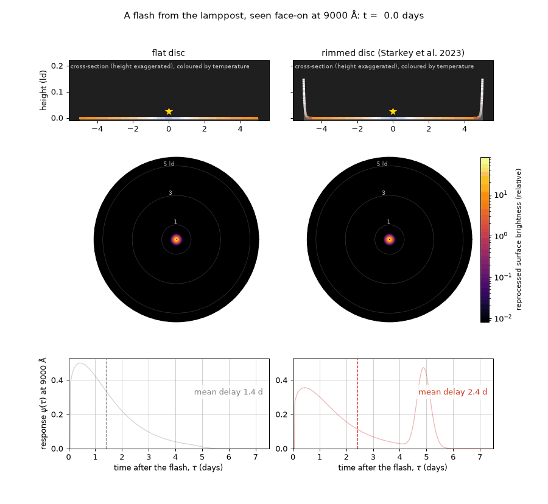
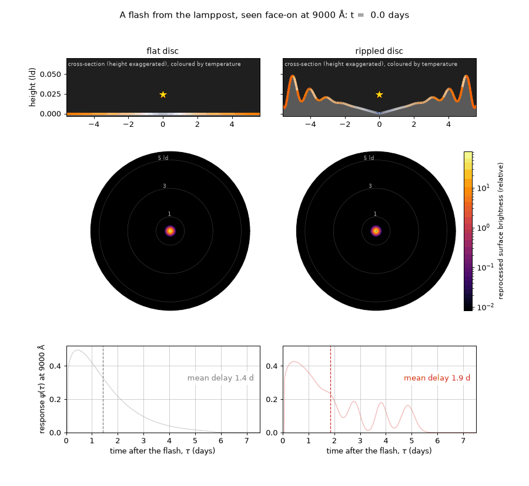
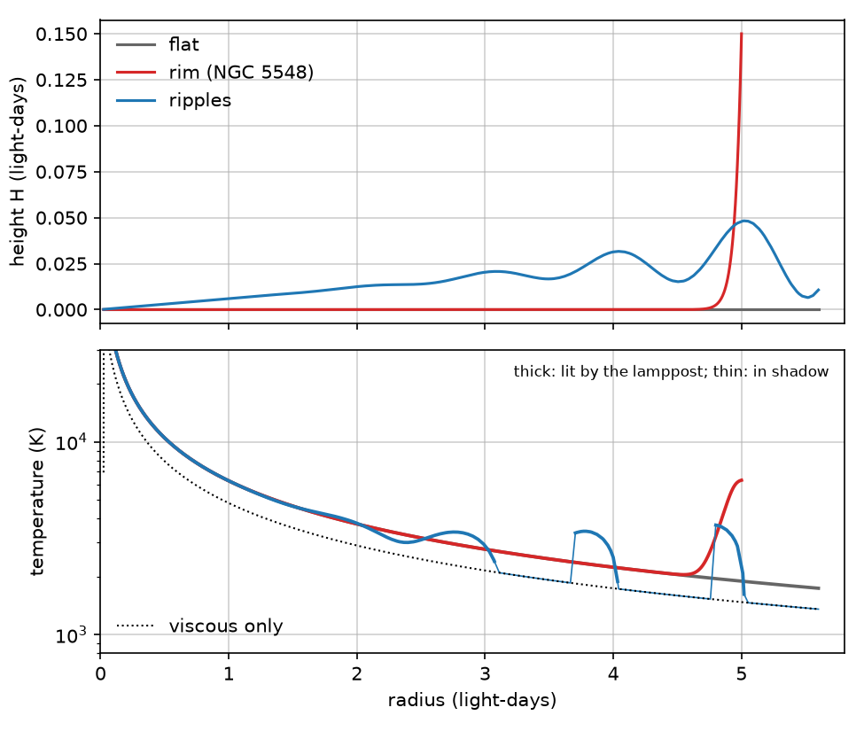
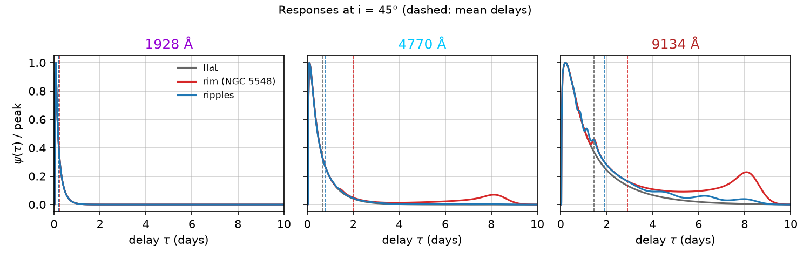
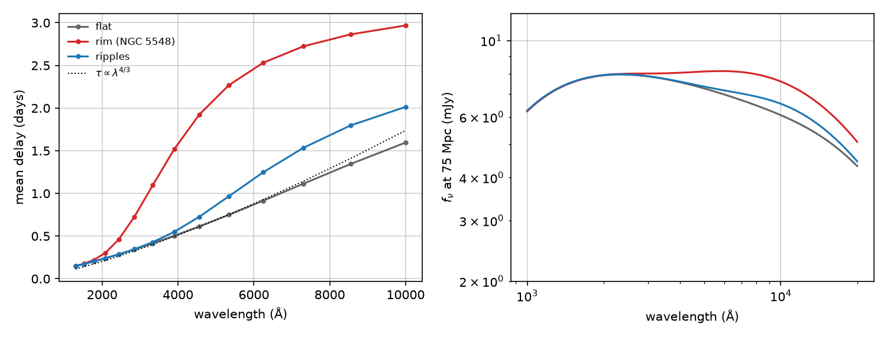
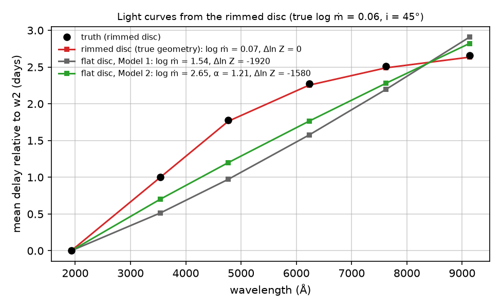

# Rimmed and rippled discs

`pycream2.rippled_disc` implements the rimmed and rippled accretion discs of
Starkey, Huang, Horne & Lin (2023, MNRAS 519, 2754;
[arXiv:2212.01379](https://arxiv.org/abs/2212.01379)). It is a response
function with pycream2's usual contract, so it drops into any fit, together with
the disc's spectrum. This page covers four things:

- what the model is;
- how it is implemented, and where that differs from the paper;
- how it was validated;
- what happens when light curves from a rimmed disc are fitted with a flat one.

Everything here uses simulated data.



*A flash from the lamppost, seen face-on at 9000 Å. Top: each disc's
cross-section (height exaggerated, coloured by temperature) and the flash's light
front. Middle: where the flash is being reprocessed at that moment. Bottom: the
response functions filling in.*

The flat disc's response comes from its hot inner parts and is over within about
a day. The rim's inner face is tilted towards the lamppost, so it intercepts far
more of the flash than a flat disc at the same radius. It lights up as a bright
ring when the front reaches it, about 5 days after the flash, and pulls the mean
delay from 1.4 to 2.4 days.



*The same flash on a rippled disc (`EXAMPLE_RIPPLES`).* Each crest's inward-facing
slope intercepts the flash and lights up in turn, while the trough behind it lies in
the crest's shadow and stays dark. The response becomes a series of bumps, one per
crest, spaced by the ripples' one-light-day wavelength. Smaller crests than the rim
give a smaller effect: the mean delay rises from 1.4 to 1.9 days.

Regenerate the animations with `scripts/animate_rippled_disc.py` (the rim) and
`scripts/animate_rippled_disc.py --model ripples`.

## Why: the disc-size problem

Continuum reverberation mapping finds delays about two to three times longer than
a standard thin disc of the AGN's luminosity gives. A flat disc intercepts only a
small fraction of the lamppost's light at large radii. Its outer parts are
therefore heated mostly viscously: about 1500 K at 5 light-days in the paper's
NGC 5548 model. They respond weakly, so the optical delays stay short.

Starkey et al. give the disc a thickness profile $H(r)$. Any part of the surface
tilted towards the lamppost intercepts more of its light, and is hotter and more
responsive than a flat disc at the same radius. A steep rim at about 5
light-days, near the dust sublimation radius, is heated to about 6000 K. That
lengthens NGC 5548's optical delays to the observed values while barely changing
the disc's spectrum.

## The model

The paper's equations, with $r$ in light-days:

- **Height** (its eqs. 15 and 22):
  $H(r) = H_1 (r/r_1)^\beta\,[1 + A(r)\cos(kr)]$, with
  $A(r) = A_w (r/r_1)^{-\beta_w}$.
  - A rim is a steep power law ($\beta \sim 100$) that ends at $r_\mathrm{out} = r_1$.
  - Ripples are the cosine term.
  - In code: `disc_height(r, height, r_ref, beta, ripple_amplitude, ripple_wavelength, ripple_slope)`, with $k = 2\pi$/`ripple_wavelength`.
- **Covering factor** (its eq. 16, in general form):
  $f = (rH' - H + H_\mathrm{LP})/r$. It is positive where the surface faces the
  lamppost.
- **Temperature** (its eq. 3), in units of $T_1^4$, the viscous $T^4$ at one
  light-day (`forward_model.disk_t1_kelvin`):
  $T^4/T_1^4 = r^{-3}\left[(1-\sqrt{r_\mathrm{in}/r}) + \tfrac43\,\epsilon_\mathrm{LP}\,(r/r_g)\,f\right]$.
  - $r_g = GM/c^2$.
  - $\epsilon_\mathrm{LP} = L_\mathrm{LP}(1-A)/\dot M c^2$ is the lamppost's
    reprocessed luminosity in units of $\dot Mc^2$ (`lamppost_efficiency`).
  - The irradiation term applies only where the surface is lit.
- **Delay** (its eq. 11):
  $c\tau = \sqrt{\Delta h^2 + r^2} + \Delta h\cos i - r\cos\phi\sin i$, with
  $\Delta h = H_\mathrm{LP} - H(r)$ and $\phi = 0$ towards the observer.
- **Response** (its eq. 12): each surface element contributes
  $\partial B_\nu/\partial T\;\partial T/\partial L_\mathrm{LP}$ times its solid
  angle on the observer's sky.

**Shadows.** A point is lit when two conditions hold:

- its elevation seen from the lamppost, $(H - H_\mathrm{LP})/r$, is rising with
  radius ($f > 0$, so the surface faces the lamppost);
- that elevation is at least the largest at any smaller radius, so no inner crest
  or rim is in the way.

Shadowed gas is only viscously heated, and does not respond.



*The flat disc, the NGC 5548 rim and illustrative ripples (`NGC5548_RIM`,
`EXAMPLE_RIPPLES`), all for a black hole of 7×10⁷ M☉ whose viscous disc is at
1500 K at 5 light-days ($T_1$ = 5000 K), with $\epsilon_\mathrm{LP}$ = 0.2. On the
ripples only the inward-facing slopes are lit (27 per cent of the disc beyond 3
light-days), at about 3500 K against 1500 to 2000 K in the shadows. The rim's
face reaches 6000 K.*

## Implementation

**A two-dimensional quadrature.** `thin_disk_response` reduces the disc integral
exactly to one dimension, because there the delay is quadratic in $r$ at fixed
azimuth. With a height profile it no longer is. `rippled_disc_response`
therefore works over a (radius, azimuth) grid:

- it computes each element's delay and weight (`response_elements`);
- it deposits each element on the lag grid with linear weights;
- it smooths the result by 5 per cent in $\ln\tau$, like `thin_disk_response`.

The response stays differentiable in `log_mdot` and `inclination`. It costs
about 20 ms per band under `jax.jit` on a laptop, with the default 400 radii
(refined automatically across a rim and per ripple) and 180 azimuths. That is
about four times `thin_disk_response`.

**The geometry is fixed, not fitted.** The height profile, the lamppost's height
and $\epsilon_\mathrm{LP}$ are plain numbers. They set the radial grid and the
shadows, which are computed once, outside the gradient. Use the model in a fit
through the usual swap point:

```python
import functools
import pycream2.model as model
from pycream2.rippled_disc import rippled_disc_response, NGC5548_RIM
model.response_function = functools.partial(rippled_disc_response, **NGC5548_RIM)
```

`rippled_disc_fnu` gives the disc's spectrum (the paper's eq. 9). Simulated light
curves come from `generate_synthetic_dataset(response=...)`.

### Where it differs from the paper

- **Irradiation geometry** (`exact_irradiation`, default `True`).
  - The paper's eq. 3 takes the irradiating flux as $f/r^2$: the small-angle
    form, per unit area of the disc's plane.
  - The default here is the exact flux on the surface,
    $\cos(\text{incidence})/d^2$ per unit surface area, which is
    $rf/(d^3\sqrt{1+H'^2})$ with $d$ the true distance to the lamppost.
  - The two agree for gentle slopes away from the lamppost. On the rim's face
    ($H' \approx 3$) the paper's form gives about three times the flux, and for
    a vertical wall it grows without limit.
  - `exact_irradiation=False` reproduces eq. 3 exactly. At $\epsilon_\mathrm{LP}$ = 1
    the rim's face reaches 12,000 K that way, against 9,000 K with the exact
    form.
- **Inner radius.** The responding disc starts at the viscous temperature peak,
  1.36 $r_\mathrm{in}$ with $r_\mathrm{in} = 3R_\mathrm{S}$, as in
  `thin_disk_response`. The paper uses the ISCO of a spinning black hole.
- **Projection towards the observer.** Each surface element's projected area is
  $\cos i - H'\sin i\cos\phi$, so a rim's far-side face is seen nearly face-on
  and its near-side face not at all. Occultation of one part of the disc by
  another (a rim hiding the inner disc at high inclination) is not modelled.
- **A near-vertical rim's own mean delay.**
  - Weighting each part of the face by its projected area gives
    $r_\mathrm{out}(1 + \tfrac{\pi}{4}\sin i) + (H_\mathrm{LP} - \langle H\rangle)\cos i$
    (tested).
  - The paper's eq. 21 has $\tfrac23$ in place of $\tfrac{\pi}{4}$: a slightly
    different distribution of delays across the face.

## Validation

`tests/test_rippled_disc.py` checks:

- **The flat limit.**
  - A flat disc without irradiation heating is `thin_disk_response`'s viscous disc.
  - Mean and median delays agree to better than 1 per cent at 2000 and 9000 Å,
    face-on and at 45°.
  - This independently checks both codes: one is a 2-D quadrature, the other an
    exact 1-D reduction.
- **The paper's equations.**
  - The height profiles (eqs. 15 and 22).
  - Eq. 3 itself (with `exact_irradiation=False`).
  - Its shadow condition for a convex disc: lit only inside
    $r_\beta = r_1(H_\mathrm{LP}/H_1(1-\beta))^{1/\beta}$ (eqs. 16 and 17).
- **Ripple shadows.** Only slopes facing the lamppost are lit, and some of them lie
  in the shadow of the crest inside them.
- **The vertical-wall delay** above, at 30° and 60°.
- **The rim's effect.** It lengthens the optical delays and flattens the lag
  spectrum at long wavelengths.
- **Numerics.**
  - The response is causal and normalised, with finite gradients under `jax.jit`.
  - The flat disc's spectrum matches `disc_sed`'s.
- **Recovery from simulated light curves.** See the next section.

## Delays and spectra





At 45°:

| | mean delay 1928 Å | 5000 Å | 9134 Å | $f_\nu$(5000 Å) at 75 Mpc |
|---|---|---|---|---|
| flat disc | 0.22 d | 0.69 d | 1.45 d | 7.3 mJy |
| rim (NGC 5548) | 0.26 d | 2.13 d | 2.91 d | 8.1 mJy |
| ripples | 0.22 d | 0.86 d | 1.89 d | 7.4 mJy |

The rim triples the optical delay but adds only 12 per cent to the disc's flux.
The lag spectrum rises steeply through the optical, then flattens as the delays
approach the rim's own, about $r_\mathrm{out}(1+\sin i)$ at most. A flat disc
follows $\tau\propto\lambda^{4/3}$.

## Fitting a flat disc to a rimmed disc

Light curves in six bands (1928 to 9134 Å, 150 points each, 2 per cent noise,
250 days) were simulated from the NGC 5548 rim at $i$ = 45° and fitted with
`optimise()`:

| fitted model | log ṁ (truth 0.06) | $i$ (truth 45°) | temperature slope | Δln Z |
|---|---|---|---|---|
| rimmed disc, geometry fixed at the truth | 0.070 ± 0.011 | 44.0° ± 0.4 | (3/4) | 0 |
| flat thin disc (Model 1) | 1.545 ± 0.011 | 51.1° ± 0.5 | (3/4) | −1920 |
| flat thin disc, free slope (Model 2) | 2.65 ± 0.05 | 50.5° ± 0.4 | 1.21 ± 0.02 | −1580 |



The rimmed model recovers the truth. The flat disc can't reproduce the rim's
delays. It compromises on a much hotter disc: $T_1$ = 11,800 K instead of 5,000 K.
Relative to the UV, its delays are too short in the blue and too long at
9000 Å. With a free temperature slope it prefers $\alpha \approx 1.2$, steeper than
3/4, because the rim's lag spectrum is flatter than $\lambda^{4/3}$ at long
wavelengths.

The mis-fit leaves two signatures:

- **A disc-size problem.** At the true distance, the flat disc these delays imply
  is 3.7 to 4.9 times brighter than the true disc, and 1.9 to 2.2 times larger.
  A disc-size test (`disc_sed`) would read that as a disc too large for its
  brightness.
- **A steep temperature slope** in Model 2.

So a rim produces, in simulation, the same kinds of discrepancy seen in real
campaigns. Whether it explains any particular AGN is a separate question, not
addressed here.

Regenerate the figures and the table with `scripts/plot_rippled_disc.py`
(`--skip-fits` reuses `docs/images/rippled_disc_synthetic.json`).

## Caveats

- **The geometry is not fitted.** Fitting the rim's radius and height, or the
  ripples, would need them as sampled parameters and a differentiable shadow. Not
  done.
- **The presets are illustrative.** $\epsilon_\mathrm{LP}$ = 0.2 is chosen so the
  NGC 5548 rim reaches about 6000 K, as in the paper. `EXAMPLE_RIPPLES` is not
  from the paper.
- **Fitting cost.** The response costs about four times as much as
  `thin_disk_response` per call. A direct solve (`optimise()`) of six bands takes
  about four minutes on a laptop.
- **Observer-side occultation** is not modelled; see above.
