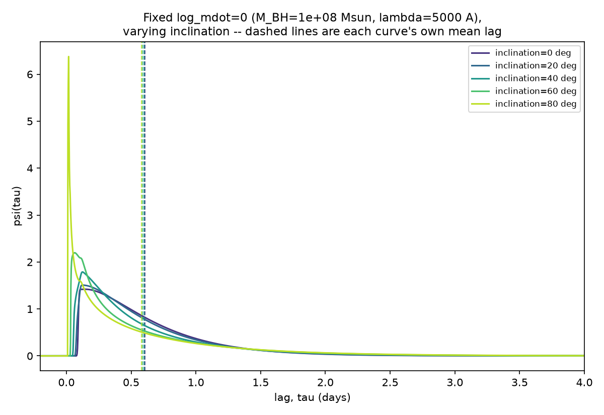
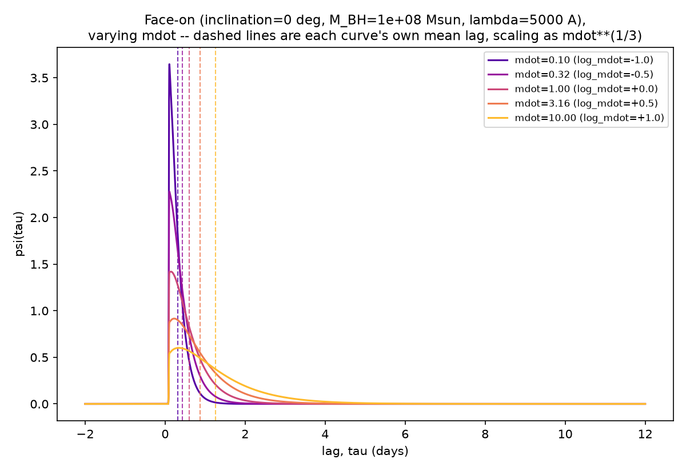
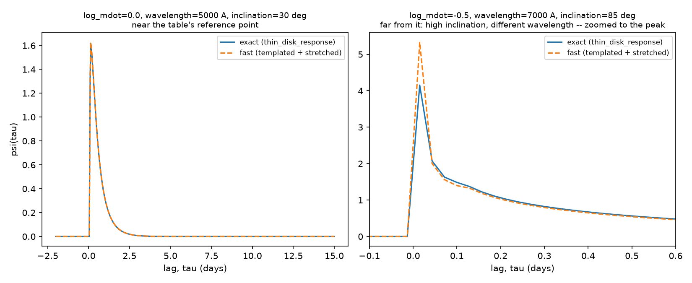

# The thin-disk accretion response function

> **Update (September 2026).** Two things below describe the response as it
> was before a direct comparison with CREAM's own Fortran response
> ([Comparison with CREAM's response](cream_response_comparison.md)):
>
> - **The delay surface now includes the lamppost height** (section 3).
> - **The default smoothing is now a causal, 5 per cent Gaussian in ln τ**
>   rather than a Gaussian in τ (section 5), so the response is zero at zero
>   lag.
>
> The sections keep their original derivations, with a note where the current
> code differs.

`forward_model.thin_disk_response` is a physically-motivated alternative to
the default skew-normal `response_function` (see the README's "Swapping the
response function" section and `CLAUDE.md`'s design decisions #5, #8
and #9). This document works through exactly how it is computed, step by step,
covers the Gaussian smoothing applied on top of the exact physics and the
trade-off that comes with it (section 5), shows the two scaling checks
worth seeing on a chart rather than taking on faith (section 6: that
inclination reshapes the response without moving its mean lag much, and
that the mean lag grows with accretion rate the way thin-disk theory says
it should), and covers the precomputed-template fast path
(`build_thin_disk_response_fast`, section 7).

The physics follows Starkey, Horne & Villforth (2016, MNRAS 456, 1960;
[arXiv:1511.06162](https://arxiv.org/abs/1511.06162), the CREAM paper),
which in turn cites Cackett, Horne & Winkler (2007) for the response
function derivation, and the author's PhD-era Fortran CREAM code
(`pycecream`'s `cream_f90.f90`, the `tfbx`/`tr4visc`/`tr4irad` subroutines)
for the original numerical (Monte Carlo) implementation. This is not a
line-by-line translation of either: the Fortran evaluates the response by
random sampling and Gaussian smoothing (not reproducible/differentiable in
a NUTS-friendly way), and Starkey+2016 itself evaluates it numerically too.
Section 4 below works through an exact **analytic** reduction of the
geometry and physics instead; section 5 then adds Gaussian smoothing back
on top of that exact result, for reasons that turned out to matter and are
worth reading rather than skipping.

## 1. The physical picture

A thin accretion disk reprocesses the AGN's variable ionising continuum
into thermal (viscous) and reprocessed (irradiation-heated) emission at
every radius `r` and azimuth `phi`. A patch of disk at `(r, phi)` sees the
driving continuum after a light-travel-time delay set by the disk's
geometry, and re-emits at a wavelength set by its own temperature. Summed
over the whole disk, this gives a causal, positive transfer function
`psi(tau)`, the fraction of the reprocessed response arriving with delay
`tau`, exactly what `response_function` also computes, just with the
skew-normal shape swapped out for the real geometry and temperature
physics.

## 2. Temperature profile

Two heating mechanisms are combined, each raised to the 4th power of
temperature (as radiative flux balance requires) and summed -- this is
Starkey+2016 eq. 2 exactly:

```
T**4(r) = 3GM*Mdot/(8 pi sigma r**3) * (1 - sqrt(r_in/r))     [viscous]
          + L_b*(1-a)*h_x / (4 pi sigma x**3)                  [irradiation]
```

with `x = sqrt(r**2 + h_x**2)` the distance from the lamppost (at height
`h_x` above the disk plane) to the surface element, `L_b = eta*Mdot*c**2`
the lamppost's bolometric luminosity, `a` the disk albedo, and `r_in` the
innermost stable circular orbit, **3 Schwarzschild radii for a
non-spinning black hole** -- confirmed against both the published paper's
own statement of this ("`rin` is the innermost stable circular orbit
(3 rs for a Schwarzschild black hole)") and the Fortran's own default
(`rinld = 3*f_rs2ld(rinsch, embh)` with the active default `urin = 1.0`,
i.e. `rinsch=1` giving exactly 3 Schwarzschild radii too -- there's a
separate, *commented-out* `urin = 3.0` line in the Fortran that would give
9 Rs instead, but it isn't the one actually used).

**Viscous heating**, with an inner boundary term that drives the
temperature smoothly to zero at `r_in`:

```
T_visc**4(r) = K_visc * (1 - sqrt(r_in / r)) / r**3
```

**Lamppost irradiation** (optional, `include_irradiation=True`): the *true*
lamppost geometry above, not a `~1/r**3` far-field approximation used in
an earlier draft of this function -- the two forms only agree for `r >>
h_x`, and `h_x` defaults to 3 Schwarzschild radii, the same order of
magnitude as `r_in` itself, so the difference matters exactly in the
regime this function spends the most time in:

```
T_irr**4(r) = K_irr * h_x / (r**2 + h_x**2)**1.5
```

`h_x` (`lamppost_height_rs`, default 3.0, Starkey+2016's own illustrative
value) is expressed in Schwarzschild radii and converted to light-days via
the same `M_BH`-based helper as `r_in`. The two terms are combined as
`T**4(r) = w * T_irr**4(r) + (1-w) * T_visc**4(r)` for a mixing weight `w`
(`irradiation_weight`), or just the viscous term alone by default.

Both `K_visc` and `K_irr`'s radial *power-law index* (`viscous_slope`,
`irradiation_slope`, default 0.75 each, the standard thin-disk value, and
what eq. 2 reduces to for `r >> r_in, h_x`) are fixed, not inferred,
matching `response_function`'s existing convention of fixed shape
hyperparameters.

**Absolute calibration -- a deliberate departure from the Fortran.** The
Fortran derives `K_visc`/`K_irr` from `G`, the Stefan-Boltzmann constant,
and a physical `Mdot` (itself derived from an Eddington ratio via
`myedrat2mdot`). Doing the same here would give `log_mdot` two different,
incompatible physical meanings depending which response function a band
used. Instead, `thin_disk_response` reuses
`forward_model.lag_scaling(log_mdot, wavelength, M_BH)` -- the same
function `response_function` uses -- to fix a characteristic radius
`r_ref` (in light-days), and Wien's displacement law,
`wavelength * T = b`, to fix the temperature at that radius. This ties the
two response families together: switching a band from `response_function`
to `thin_disk_response` keeps `log_mdot`'s meaning the same. Only the
disk's inner edge and the lamppost height use real physical constants (G,
c, M_sun) directly, since that conversion needs no accretion-rate
calibration at all.

One consequence worth being explicit about: because `r_ref` is only a
*characteristic* radius, not a promise about the resulting response's
actual mean, `thin_disk_response`'s empirical mean lag comes out somewhat
larger than `lag_scaling`'s pivot value (the physical response has real
weight extending well beyond `r_ref`) -- see the worked numbers in
section 6. `response_function`'s mean lag isn't exactly the pivot value
either, for the same reason (a skew-normal's mean isn't its `loc`
parameter once it's skewed). `lag_scaling` fixes the *scale*, not the
*exact* mean, for either response family.

## 3. Delay surface

A patch of disk at radius `r` and azimuth `phi` (measured from the
observer's line of sight projected onto the disk plane) is farther from
the observer, by light-travel time, than the disk's centre by (Starkey+2016
eq. 5):

```
tau(r, phi) = r * (1 + cos(phi) * sin(inclination))
```

Face-on (`inclination = 0`), every azimuth has the same delay `r`,
whatever the radius, so the whole ring at radius `r` contributes at a
single lag. Inclined, the near side (`cos(phi) = -1`) arrives earlier and
the far side (`cos(phi) = +1`) later than the ring's mean -- this is what
gives the response its inclination-dependent skew, exactly as
Starkey+2016 describes it: "Tilting the disc makes the response function
more skewed; it peaks at shorter lags and develops a tail toward large
lags." Critically, `integral_0^{2 pi} cos(phi) dphi = 0`, so **the ring's
mean delay is `r` regardless of inclination**: inclination reshapes the
response around a fixed mean -- the same requirement `response_function`
satisfies by construction (`CLAUDE.md` decision #4), and the paper states
explicitly too ("The mean delay... is independent of inclination"). Note
that `h_x` (the lamppost height) does *not* appear in the delay surface --
matching eq. 5 exactly -- only in the temperature profile above.

> **Update (September 2026): the delay now includes the lamppost height.**
> Measured from the direct ray, the delay is
> `tau = sqrt(r**2 + h_x**2) + h_x cos(inclination) + r cos(phi) sin(inclination)`.
>
> - Nothing responds before the shortest lamppost–disk–observer path.
> - The mean delay is `<d> + h_x cos(inclination)` exactly, so it is
>   `<tau> - h_x cos(inclination)` that is independent of inclination. The
>   difference is about 0.01 days for NGC 5548.
> - At fixed `phi` the delay is no longer linear in `r`, so section 4's single
>   root becomes the roots of a quadratic: up to two on the near side, each
>   weighted by `r / |dtau/dr|`.
> - `delay_lamppost_height=False` restores eq. 5.


This exact-independence claim is a property of the *unsmoothed* geometry
worked through here and in section 4. Section 5's default smoothing
loosens it to an approximate one -- see that section for exactly how much,
and why.

## 4. Response weight and the analytic disk integral

Each `(r, phi)` patch's contribution to `psi(tau)` is weighted by how
strongly its emission responds, in the observing band, to a small heating
perturbation: the Planck function's derivative with respect to
temperature,

```
X = hc / (k * wavelength * T(r))
weight(r) = X**5 * exp(X) / (exp(X) - 1)**2
```

times the disk-plane area element `r dr dphi`. Putting the last three
sections together, the full disk integral is:

```
psi_raw(tau) = integral_{r_in}^{infinity} integral_0^{2 pi}
                   weight(r) * delta(tau - tau(r, phi)) * r dr dphi
```

with `delta` a Dirac delta picking out exactly the `(r, phi)` patches that
land at each `tau`.

**This integral has an exact closed form in `r`, with no approximation
needed.** At *fixed* `phi`, `tau(r, phi) = r * (1 + cos(phi)
sin(inclination))` is *linear* in `r`, so the delta function collapses the
radial integral onto a single root,

```
r*(phi, tau) = tau / (1 + cos(phi) * sin(inclination))
```

with Jacobian `d(tau)/dr = 1 + cos(phi) sin(inclination)` (constant in
`r`, at fixed `phi`), leaving:

```
psi_raw(tau) = tau * integral_0^{2 pi}
                   weight(r*(phi, tau)) / (1 + cos(phi) sin(inclination))**2 dphi
```

a plain 1-D integral over a *fixed* `phi` grid (`n_phi`, evenly spaced),
evaluated the same way for every `tau_grid` point via a uniform Riemann
sum -- exact for a periodic integrand, no `trapz` edge correction needed.
This raw result is normalised to unit area on `tau_grid`, and zeroed for
`tau < 0` (automatically satisfied by the geometry: `tau(r, phi) >= r(1 -
sin(inclination)) >= 0` for `inclination <= 90` degrees). The only masking
needed is excluding `r* < r_in` (no disk material inside the ISCO), done
with a *smooth* sigmoid rather than a hard cutoff, since `r*` depends on
`inclination`, a sampled parameter, and a hard `jnp.where` there would
carry the same zero-gradient risk already documented for
`tophat_response_free` (`CLAUDE.md` decision #7).

**This replaces an earlier two-radial-grid, Gaussian-kernel-deposit
implementation entirely**, which needed a separate log-spaced radial grid
(`n_r`) and a domain cutoff (`r_max_factor`) to avoid visible quadrature
artefacts -- worst exactly at high inclination, where the naive radial
domain a face-on response needs blows up by two to three orders of
magnitude (documented at length in git history and the superseded parts of
`CLAUDE.md` decision #8, kept there as a record of what was tried and why
it wasn't good enough, not as current guidance). None of that grid/cutoff
machinery is needed here: there is no radial grid to under-resolve and no
truncation to get wrong, because the radial integral was never
approximated -- it was solved. Removing the radial dimension also drops
the cost from `O(n_r * n_phi * n_tau)` to `O(n_phi * n_tau)`, with
`n_phi=200` (the current default) already fully converged where the old
implementation needed `n_r=400` *and* still showed residual artefacts at
extreme inclination or accretion rate. (An early draft of this section
also quoted a specific "~25x faster" number for this step; that was
measured the wrong way -- see section 7's methodology-correction note --
and isn't repeated here since the old grid implementation no longer
exists to re-measure properly.)

## 5. Gaussian smoothing: a deliberate reintroduction

> **Update (September 2026): this is no longer the default.** A Gaussian in τ
> spreads the response's near-vertical onset across τ = 0. With the widths
> below, it left the smoothed response at its peak value at zero lag for
> inclined disks, and it blurred the near-peak shape that carries the
> inclination.
>
> - **The default is now a local Gaussian average in ln τ**, 5 per cent wide
>   (`smoothing_log`). It is causal by construction and shifts the mean delay
>   by about 0.1 per cent.
> - **The Gaussian in τ described here** is still available through
>   `smoothing_days` or `smoothing_frac`.
> - **Why the change:** see
>   [Comparison with CREAM's response](cream_response_comparison.md). CREAM's
>   own responses start at zero because `tfbx` hard-codes the first lag bin
>   to zero, not because of its smoothing.

Section 4's `psi_raw` is exact for the idealised model (a razor-thin disk
with a well-defined temperature at every point). Plotted directly, though,
a second user report flagged that high-inclination curves still didn't
look like Starkey+2016 Figure 3's skewed-Gaussian-like shapes -- instead
showing a sharp near-zero-lag spike (confirmed: a single, genuine local
maximum right at `tau=0`, from the disk's near-side tangent line, not a
numerical artefact) followed by an abrupt change in decay rate a bit
further out (confirmed: no interior local minimum, i.e. not literally two
separate humps with a dip between them, but enough of a kink to look
wrong).

Asked directly, at the user's prompting, whether the original Fortran
smoothed the response and whether that was implemented here: it does, and
it wasn't. Confirmed directly in `cream_f90.f90`, in *both*
response-function subroutines -- `tfbx`'s `sig_gaus = dtau` and the older
`tfb`'s `sig_g = dtau/2` -- applied not as numerical artefact clean-up but
as part of the physical model itself: every individual disk element's
contribution is deposited as a Gaussian spread across several tau bins
(`tfbx` lines ~12604-12714: the nested radius/azimuth loop computes each
grid point's `taulag` and `resp`, then spreads `resp` across
`iblo:ibhi` with Gaussian weights
`exp(-((taulag-taubin)/sig_gaus)**2 / 2)`), not a single delta-function
spike at its own exact delay.

**Smoothing each element's contribution individually and summing is
mathematically identical to computing section 4's exact integral once and
convolving *that* with the same Gaussian**, because Gaussian smoothing is
linear and `sig_gaus` is one constant for the whole disk, not varying
grid point to grid point -- not an approximation of the per-element
version, just a cheaper way to compute the same result. `smoothing_days`
implements exactly that: a single, explicit convolution of the exact
curve, re-applying the causal (`tau >= 0`) mask afterwards, since
smoothing spreads some weight from the `tau >= 0` side across the
boundary.

**The Fortran's literal `sig_gaus = dtau` convention doesn't transplant
directly**: it only smooths meaningfully because the Fortran's typical
output grids were coarse, making `dtau` incidentally comparable to a
significant fraction of a day; for a finer `tau_grid` (confirmed with an
800-point grid: `dtau` ~0.01 days) it's negligible, and it ties the disk's
own physical smoothing to an unrelated resolution choice regardless.
`smoothing_frac` (default 0.1; 0.4 until September 2026, see below) instead scales the smoothing width as
`smoothing_frac * tau_ref` (`tau_ref` from `lag_scaling`), chosen by
directly comparing rendered curves against Starkey+2016 Figure 3 (fetched
and rendered from the actual PDF, not just read from the caption text) --
smaller fractions leave a visible kink at high inclination; larger ones
start smoothing away genuine inclination-driven skew differences between
bands.

**This reintroduces a real, quantified trade-off with decision #4/section
3's exact mean-lag independence, resolved with the user directly rather
than picked unilaterally.** Smoothing enough to match the published shape
costs mean-lag drift with inclination -- monotonic in `smoothing_frac`:
0% unsmoothed, ~3% at 0.1, ~6% at 0.2, ~10% at the default 0.4 (face-on to
80 degrees). A reflecting-boundary kernel (folding smoothed-away mass at
`tau=0` back in, rather than discarding it) was tried specifically to see
if it would restore exactness, and does not: the drift turns out to be
inherent to any causally-respecting smoothing near a boundary that
high-inclination responses sit much closer to than face-on ones, not an
artefact of discarding vs redistributing leaked mass. Presented this
quantified trade-off directly; the choice was to keep `smoothing_frac=0.4`
(matching the published look) as the default over a smaller value or
defaulting to exact. `smoothing_days=0.0` disables smoothing entirely and
recovers section 3/4's exact behaviour, for anyone who wants that back --
see `tests/test_thin_disk_response.py`'s
`test_thin_disk_response_smoothing_days_zero_gives_exact_mean_lag_independence`
and `test_thin_disk_response_default_smoothing_mean_lag_drift_is_bounded`.

**Update (September 2026): the default is now `smoothing_frac=0.1`.** The 0.4 above was tuned
against responses that lacked the lamppost's `h/x**3` dilution and were far broader than they
should have been. On the corrected, compact responses 0.4 smooths over more than the mean delay:
it raises mean delays ~25% and erases most of the inclination information, which the NGC 5548
analysis measured directly. At 0.1 the mean delay drifts ~7% face-on to 80 degrees; the drift
figures above (3%, 6%, 10%) are for the old, too-broad responses. The author chose 0.1.

## 6. Verification: the two scaling-law charts

Both figures use a case-study disk with `M_BH = 1e8` solar masses and
`wavelength = 5000` Angstrom (the same pivot values used throughout
`forward_model.py` and the test suite), generated by
`scripts/plot_thin_disk_response_scalings.py` with the default smoothing
on; rerun it to regenerate these PNGs if `thin_disk_response`'s physics or
defaults change.

### Inclination sweep (fixed accretion rate)

`log_mdot = 0` throughout; only inclination varies.



| inclination (deg) | mean lag (days, numerically integrated) |
|---:|---:|
| 0  | 0.585 |
| 20 | 0.583 |
| 40 | 0.577 |
| 60 | 0.568 |
| 80 | 0.558 |

*Updated September 2026, for the current response (causal smoothing and the
lamppost height in the delay).*

- **Each response starts at its lamppost-delay onset,** with no response
  before it.
- **The near side's contribution sharpens into a spike at high
  inclination.** A small shoulder at 40 to 60 degrees, where the near- and
  far-side contributions merge, is visible now that the smoothing no longer
  hides it.
- **The mean lags fall by 0.027 days from face-on to 80 degrees.** That is
  the lamppost term $h_x(\cos 0 - \cos 80^\circ) = 0.029$ days for this
  $10^8\mkern3mu M_\odot$ disc, to within quadrature error, so
  $\langle\tau\rangle - h_x\cos i$ is flat to about 0.5 per cent.
- **The old Gaussian in τ** (section 5) raised the means to about 1.9 days
  and made them drift about 10 per cent upwards with inclination. It was
  also tuned for a response that lacked the lamppost dilution.

### Accretion-rate sweep (fixed face-on inclination)

`inclination = 0` throughout; only `log_mdot` varies.



| log_mdot | mdot | mean lag (days) | `lag_scaling` reference radius (days) |
|---:|---:|---:|---:|
| -1.0 | 0.10 | 0.302 | 0.464 |
| -0.5 | 0.32 | 0.415 | 0.681 |
| +0.0 | 1.00 | 0.585 | 1.000 |
| +0.5 | 3.16 | 0.841 | 1.468 |
| +1.0 | 10.00 | 1.223 | 2.154 |

*Updated September 2026, for the current response (causal smoothing and the
lamppost height in the delay).*

The mean lag grows monotonically with `mdot`, close to the `mdot**(1/3)`
scaling that `lag_scaling` uses. From `log_mdot=-1` to `+1` it grows by a
factor of 4.05, against an ideal `100**(1/3) = 4.64`. The difference comes
from the fixed-size terms: the inner-boundary term in section 2 and the
lamppost height (about 0.035 light-days here). Both matter most for the
smallest discs, and both bend the pure power law as they would for a real
disk. The means are about 0.6 times `lag_scaling`'s reference radius, which
is the lag-temperature relation with `y_eff` of about 3.2 (see
`test_thin_disk_mean_lag_obeys_the_standard_lag_temperature_relation`).
The old table here, with means of 1.9 times the reference radius, predated
the lamppost-dilution fix. As section 2 already flags, the
empirical mean lag sits above the `lag_scaling` reference radius at every
`mdot` -- `lag_scaling` fixes the response's characteristic scale, not its
exact mean.

## 7. A precomputed, interpolated fast path for MCMC

Even with section 4's analytic reduction, NUTS calls a band's response
function on every leapfrog step of every sample, so there is still a real
cost to recomputing the full integral (plus section 5's smoothing
convolution) that often when only `log_mdot` and `inclination` change
step to step, not the disk's physics.

`build_thin_disk_response_table` / `build_thin_disk_response_fast`
implement the same fix the author used for this in the PhD-era CREAM
Fortran code (confirmed directly in `cream_f90.f90`: a `psistore(:,ist)`
array precomputed once across an inclination grid, `degstore = (ist-1) *
ddeginc`, at one fixed reference `umdotref`/`wavref`): precompute the
response once, on a grid of inclinations, at one reference accretion rate;
then get any other inclination by interpolating that grid, and any other
accretion rate (or wavelength) by *stretching* the lag axis according to
the `mdot**(1/3)` / `wavelength**(4/3)` scaling `lag_scaling` already uses,
rather than recomputing the disk integral at all:

```python
import pycream2.model as model
from pycream2.forward_model import build_thin_disk_response_fast

model.response_function = build_thin_disk_response_fast(M_BH=1e8)
```

Concretely, for a given `(log_mdot, wavelength, inclination)`:

1. **Interpolate over inclination** (`jnp.interp`, linear, differentiable
   in `inclination` almost everywhere) against the precomputed template
   family, giving one dimensionless template on the table's own lag axis.
2. **Stretch** that template by `s = lag_scaling(log_mdot, wavelength,
   M_BH) / tau_ref_reference`: evaluate it at `tau_grid / s` and divide by
   `s` to keep the area normalised to 1 under that change of variables.
3. **Smooth**, at this query's own `tau_ref` (not the table's reference
   point).

Step 3 has to come *after* step 2, not be baked into the table: templates
are built unsmoothed (`smoothing_days=0.0` internally), and
`thin_disk_response_from_table` smooths once, post-stretch, with its own
`smoothing_frac`/`smoothing_days` (same defaults as `thin_disk_response`'s,
overridable independently of whatever `build_thin_disk_response_table`'s
own kwargs were). Smoothing *before* stretching would stretch the
smoothing bandwidth right along with everything else, silently coupling
two things that should be independent -- confirmed to matter a lot when
first wired the other way round: even the near-reference-point case (which
should be almost exact) was off by ~13% at the peak; doing it in this
order brings that back under 1%.

Both interpolation steps are lookups against fixed tables, `O(n_u +
n_tau)` rather than `O(n_phi * n_tau)`, plus the same `O(n_tau^2)`
smoothing convolution `thin_disk_response` itself now also pays for.

**A methodology correction, worth being upfront about:** every speed
number in earlier drafts of this section (and of `CLAUDE.md`'s matching
design decisions) was measured with plain, eager (non-`jax.jit`) repeated
Python calls -- not what actually happens inside a NUTS fit, where
NumPyro `jax.jit`-compiles the whole log-density function once and every
leapfrog step reuses that compiled executable, none of eager timing's
per-call Python dispatch overhead included. Checked directly: at
`n_tau=600`, an eager call to `thin_disk_response` took ~134ms; the exact
same call through `jax.jit` took ~2.6ms, a ~50x gap that has nothing to
do with either function's real cost. The old "~90x -> ~4x -> ~1.3-1.5x"
progression this section used to report is unreliable as a result, and
in fact went the *wrong direction* at at least one point: re-measured
under `jax.jit`, right after section 4's analytic rewrite but before this
section's smoothing was reintroduced, the fast path was actually **~13x
faster**, not the ~4x the eager measurement had claimed.

**Properly measured now** (`jax.jit`, `n_tau=400`, matching
`EchoFit.build_grid()`'s own default): `thin_disk_response` (with default
smoothing) costs ~1.5ms per call, the templated fast path ~0.55ms --
**~2.8x faster**, with a range of roughly 2x-5x depending on `n_tau`
(checked at 150/400/600; precomputing the table itself still takes ~3
seconds regardless). Smoothing itself turns out to add real, non-negligible
cost once jitted (~1.5x over `smoothing_days=0.0`, where the eager
measurement had suggested it was nearly free). Both `thin_disk_response`
variants remain substantially more expensive than the closed-form
`response_function` even fast and jitted -- ~12x for the templated path,
~34x for the plain one, at the same settings -- confirming this is an
inherent cost of doing a real disk integral rather than an assumed
closed-form shape, not something either optimisation removes. Still a
real, essentially-free win at call time over the plain version, worth
reaching for on long runs where every bit of per-step cost compounds, but
not a way to make `thin_disk_response` competitive with the skew-normal's
cost -- see `CLAUDE.md` decision #9 for a note on a banded/truncated
smoothing kernel that was prototyped and found faster still, but has a
real edge-handling bug and wasn't pursued given how small the absolute
costs already are once properly jitted. Gradients w.r.t. `log_mdot` and
`inclination` are still non-zero (checked with `jax.grad`, including at
an inclination *not* on the precomputed grid, the same discipline used
for `thin_disk_response` and `tophat_response_free`'s gradients elsewhere
in this codebase).

**The stretch is still an approximation, not an identity, independent of
smoothing.** The disk isn't *exactly* self-similar under it: `r_in` (the
ISCO) is a fixed absolute length, so it doesn't stretch along with
everything else, meaning `r_in / tau_ref` -- and with it, how much the
inner boundary term shapes the response -- genuinely differs between the
table's reference point and wherever a fit actually queries it. In
practice this still shows up most wherever the response is sharpest: at
high inclination, near the near-zero-lag feature from the disk's near
side.



*Updated September 2026, for the current response.*

- **Near the table's reference point** (`log_mdot=0`, `wavelength=5000`
  Angstrom), the two curves are visually indistinguishable.
- **Far from it** (`inclination=85` degrees, `wavelength=7000` Angstrom,
  `log_mdot=-0.5`), the fast path now overshoots the exact near-side spike by
  about 30 per cent of the peak, while the tail agrees to a few per cent. It
  was 0.7 per cent before the causal smoothing replaced the Gaussian in τ.
  - The old smoothing blurred the spike on both curves alike, hiding their
    difference.
  - Unsmoothed, the spike is shaped by fixed-size parts of the disk: the
    inner edge and, now, the lamppost height in the delay. The stretch cannot
    reproduce these (see above).
  - This figure's lag grid, 0.03 days, is also coarse for a spike a few
    hundredths of a day wide.

The fast path is opt-in and used by nothing by default. If a fit's posterior is expected to live mostly at
high inclination and/or spans multiple bands at very different
wavelengths, building the table with `reference_wavelength` set closer to
the run's own wavelength(s) narrows this further; using the exact
`thin_disk_response` directly removes it entirely, at the ~2-5x per-step
cost difference from above. This tradeoff, not a hidden
bug, is exactly what
`tests/test_thin_disk_response_fast.py::test_fast_response_approximation_degrades_away_from_reference`
checks for.

## 8. API summary

```python
from pycream2.forward_model import thin_disk_response, build_thin_disk_response_fast
from pycream2.responses import get_response
import pycream2.model as model

# use the exact disk integral directly (default: smoothed, see section 5)
psi = thin_disk_response(tau_grid, log_mdot, wavelength, inclination, M_BH)

# unsmoothed / exact mean-lag-independence version
psi_exact = thin_disk_response(tau_grid, log_mdot, wavelength, inclination, M_BH, smoothing_days=0.0)

# or swap it in for "physical"-mode bands (see CLAUDE.md decision #5)
model.response_function = get_response("thin_disk")

# or use the precomputed-template fast path (section 7) for a real fit --
# now a smaller win than it used to be, since thin_disk_response itself
# got much cheaper, but still free performance with a documented accuracy
# tradeoff
model.response_function = build_thin_disk_response_fast(M_BH=1e8)
```

See `thin_disk_response`'s own docstring in `forward_model.py` for the
full parameter list (`viscous_slope`, `include_irradiation`,
`irradiation_slope`, `irradiation_weight`, `lamppost_height_rs`, `n_phi`,
`smoothing_frac`, `smoothing_days`), `build_thin_disk_response_table`'s
docstring for the fast path's own precompute parameters (`incl_grid`,
`reference_log_mdot`, `reference_wavelength`, `u_max_factor`, `n_u`),
`thin_disk_response_from_table`'s for its own smoothing parameters, and
`README.md`'s "Swapping the response function" section for how these
relate to the default skew-normal and to `pycream2/responses.py`'s
registry.
